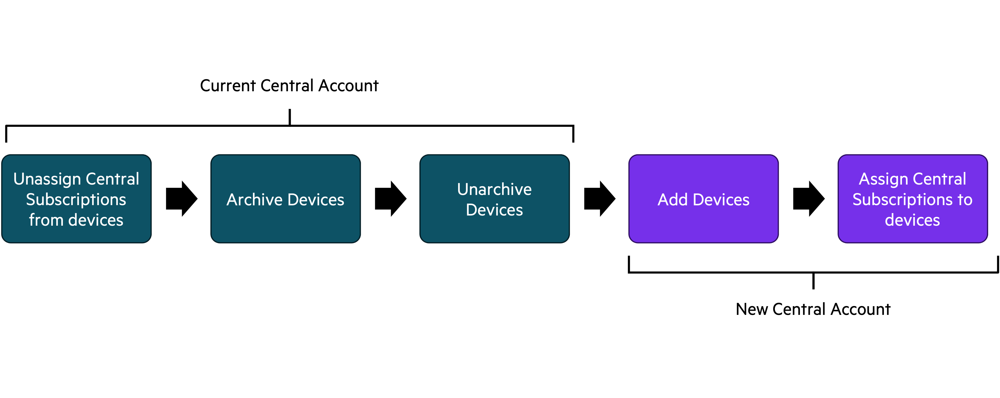

# Device Inventory Migration

Some of our customers may be managing multiple instances of Central. In such a scenario, they may sometimes have to move devices between instances of Central. Its possible to do this through the the GLCP & Central User Interface and via Central APIs. When multiple devices have to be moved between accounts, this can lead to the customer have to click through multiple lot of clicks  has to be done for multiple devices, this workflow could result in multiple clicks. This makes the workflow prone to accidental clicks and human error. 

The script in this workflow automates the above process by using [Pycentral](https://pypi.org/project/pycentral/) library to do the following steps -
In the **current** Central Account - 
1. Unassign Central Subscriptions from Device(s)
2. Archive Device(s)
3. Unarchive Device(s)
After the above steps are completed in the **current** Central account, then in the **new** Central account - 
1. Add Device(s)
2. Assign Central Subscription to Device(s)


**Note** - Throughout this README & the script -
1. **current** - This refers to the Central account from which devices have to be migrated from
2. **new** - This refers to the Central account to which devices have to be migrated into 




## Prerequisite
1. Device(s) in the current Central account have Central Subscriptions associated with them
2. The new Central account's subscription inventory has available seats in the same Central subscription tier that the devices are subscribed to in the current Central account.

## Installation Steps
In order to run the script, please complete the steps below:
1. Clone this repository and `cd` into the workflow directory:
    ```bash
    git clone https://github.hpe.com/hpe/central-python-workflows
    cd central-python-workflows/device_inventory_migration/
    ```
   
2. Install virtual environment (refer https://docs.python.org/3/library/venv.html). Make sure python version 3 is installed in system.
    ```bash
    python -m venv env
    ```

3. Activate the virtual environment
    In Mac/Linux:
    ```bash
    source env/bin/activate
    ```
    In Windows:
    ```bash
    env/Scripts/activate.bat
    ```

4. Install the packages required for the script
    ```bash
    python -m pip install -r requirements.txt
    ```
5. Provide the Central API Gateway Base URL & Access Token in the [current_central_token.json](current_central_token.json) and [new_central_token.json](new_central_token.json) for both the Current & New Central Account Instances.
    ```json
    {
        "central_info": {
            "base_url": "<api-gateway-domain-url>",
            "token": {
                "access_token": "<api-gateway-access-token>"
            }
        },
        "ssl_verify": true
    }
    ```
    **Note**
   - [BaseURLs of Aruba Central Clusters](https://developer.arubanetworks.com/aruba-central/docs/api-oauth-access-token#table-domain-urls-for-api-gateway-access)
   - [Generating Access token from Central UI](https://developer.arubanetworks.com/aruba-central/docs/api-gateway-creating-application-token)
   - [Generating Access token using OAuth APIs](https://developer.arubanetworks.com/aruba-central/docs/api-oauth-access-token)
6. *(Optional)* You can skip this step if you are migrating all devices from the current Central account to the new Central account. Update the placeholder data of device details in [device_list.json](device_list.json). Please provide the serial numbers of the devices you would like to migrate
    ```json
    {
        "device_list": [
            "<device-serial-1>",
            "<device-serial-2>"
        ]   
    }
    ```
7. Once **central_token.json** & **device_list.json** are updated with the relevant information, you can execute the script. 
   1. If you would like migrate all devices in the current Central account run this command:
   ```bash
    python device_inventory_migration.py --all_devices
    ```
   2. If you would like to migrate some devices from the current Central account run this command:
   ```bash
    python device_inventory_migration.py --device_list device_list.json 
    ```
    **Note**  
    - This script takes the following optional parameters to overide default filenames for the script
      - current_central_auth - Path of Central Token File of Current Central Account
      - new_central_auth - Path of Central Token File of New Central Account
      - device_list - Path of Device List File

## Central APIs used for this workflow
1. [Get devices from device inventory](https://developer.arubanetworks.com/aruba-central/reference/acp_servicenb_apiapidevice_inventoryget_devices)
2. [Unassign subscription to a device](https://developer.arubanetworks.com/aruba-central/reference/acp_servicelicensewebviewsadmin_licenseapigw_unassign_licenses-1)
3. [Archive devices using Serial list](https://developer.arubanetworks.com/aruba-central/reference/acp_servicenb_apiapidevice_inventoryarchive_devices)
4. [Unarchive devices using Serial list](https://developer.arubanetworks.com/aruba-central/reference/acp_servicenb_apiapidevice_inventoryunarchive_devices)
5. [Add device using Mac and Serial number](https://developer.arubanetworks.com/aruba-central/reference/acp_servicenb_apiapidevice_inventoryadd_device)
6. [Assign subscription to a device](https://developer.arubanetworks.com/aruba-central/reference/acp_servicelicensewebviewsadmin_licenseapigw_assign_licenses-1)

## Note
This Python script was tested on Central version 2.5.7
