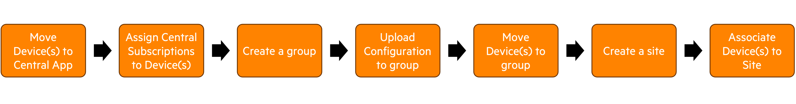

# Device Onboarding
This is a Python script that uses the [Pycentral](https://pypi.org/project/pycentral/) library to achieve the following steps on an Aruba Central account- 
1. Assign Devices to Central Application Instance
2. Provide Devices with Central Subscriptions.
3. Create a template group (Template-based group)
4. Upload Configuration Template to Group
5. Move Devices to the newly created Group.
6. Create a Site
7. Move Devices to the newly created Site.



## Prerequisite
1. The Aruba Central application is installed in the Greenlake account in which the devices are present.
2. The devices used in the workflow are not assigned to any application in the Greenlake account and do not have any subscriptions associated with them.
3. The subscription that the workflow utilizes is not expired and has open seats for assignment.
4. The group and site that the workflow creates does not already exist in the Central account.

## Installation Steps
In order to run the script, please complete the steps below:
1. Clone this repository and `cd` into the workflow directory:
    ```bash
    git clone https://github.com/aruba/central-python-workflows
    cd central-python-workflows/device_onboarding
    ```
   
2. Install virtual environment (refer https://docs.python.org/3/library/venv.html). Make sure python version 3 is installed in system.
    ```bash
    python -m venv env
    ```

3. Activate the virtual environment

    In Mac/Linux:
    ```bash
    source env/bin/activate
    ```
    In Windows:
    ```bash
    env/Scripts/activate.bat
    ```
4. Install the packages required for the script
    ```bash
    python -m pip install -r requirements.txt
    ```
5. Provide the Central API Gateway Base URL & Access Token in the [central_token.json](central_token.json)
    ```json
    {
        "central_info": {
            "base_url": "<api-gateway-domain-url>",
            "token": {
                "access_token": "<api-gateway-access-token>"
            }
        },
        "ssl_verify": true
    }
    ```
    **Note**
   - [BaseURLs of Aruba Central Clusters](https://developer.arubanetworks.com/aruba-central/docs/api-oauth-access-token#table-domain-urls-for-api-gateway-access)
   - [Generating Access token from Central UI](https://developer.arubanetworks.com/aruba-central/docs/api-gateway-creating-application-token)
   - [Generating Access token using OAuth APIs](https://developer.arubanetworks.com/aruba-central/docs/api-oauth-access-token)
6. Update the placeholder data of Group, Site & Device details in [workflow_variables.json](workflow_variables.json) to match your environment. 
    ```json
    {
        "device_details": {
            "SWITCH": {
                "<device-serial-1>": {
                "mac_address": "<device-1-mac-address-1>",
                "central_subscription": "<subscription-type-for-device-1>"
            },
            "<device-serial-2>": {
                "mac_address": "<device-2-mac-address>",
                "central_subscription": "<subscription-type-for-device-2>"
            }
        },
        "IAP": {
            "<device-serial-3>": {
                "mac_address": "<device-3-mac-address>",
                "central_subscription": "<subscription-type-for-device-2>"
            }
        }
    },
        "group_details": {
            "name": "<group-name>",
            "attributes": {
                "template_info": {
                    "Wired": true,
                    "Wireless": true
                },
                "group_properties": {
                    "AllowedDevTypes": [
                        "AccessPoints",
                        "Switches"
                    ],
                    "Architecture": "Instant",
                    "ApNetworkRole": "Standard",
                    "AllowedSwitchTypes": [
                        "AOS_CX"
                    ]
                }
            },
            "config_templates": {
                "CX": {
                    "template_name": "<template_name>",
                    "template_filename": "<template_file_path>",
                    "version": "<version>",
                    "model": "<model>"
                },
                "IAP": {
                    "template_name": "<template_name>",
                    "template_filename": "<template_file_path>",
                    "version": "<version>",
                    "model": "<model>"
                }
            }
        },
        "site_details": {
            "name": "<site-name>",
            "address": {
                "address": "",
                "city": "",
                "state": "",
                "country": "",
                "zipcode": ""
            }
        }
    }
    ```
    **Note**
      - 
      - The `attributes` section for `group_details` supports all attributes that are available for `group_attributes` for [this API](https://developer.arubanetworks.com/aruba-central/reference/apigroupscreate_group_v3).
7. Once **central_token.json** & **workflow_variables.json** are updated with the relevant information, you can execute the script with the following command:
   ```bash
    python device_onboarding.py
    ```
    **Note**  
    - This script takes the following optional parameters to overide default filenames for the script
      - central_auth - Path of Central Token File
      - workflow_variables - Path of Workflows Variables File  
    - You can run the following command to use the optional parameters -
     ```bash
    python device_onboarding.py --central_auth <central_token_file> --workflow_variables <workflow_variables_file>
    ```
8. If the script runs successfully, your terminal output should look like this -
    <p align="center">
        
    </p>

## Central APIs used for this workflow - 
1. [Add device using Mac and Serial number](https://developer.arubanetworks.com/aruba-central/reference/acp_servicenb_apiapidevice_inventoryadd_device)
2. [Assign subscription to a device](https://developer.arubanetworks.com/aruba-central/reference/acp_servicelicensewebviewsadmin_licenseapigw_assign_licenses-1)
3. [Create new group with specified properties](https://developer.arubanetworks.com/aruba-central/reference/apigroupscreate_group_v3)
4. [Create new template](https://developer.arubanetworks.com/aruba-central/reference/apitemplatescreate_template)
5. [Move devices to a group](https://developer.arubanetworks.com/aruba-central/reference/apigroupsmove_devices)
6. [Create Site](https://developer.arubanetworks.com/aruba-central/reference/sitesexternal_controllercreate_site)
7. [Associate Site to a list of devices](https://developer.arubanetworks.com/aruba-central/reference/sitesexternal_controllerassign_site_to_devices)
