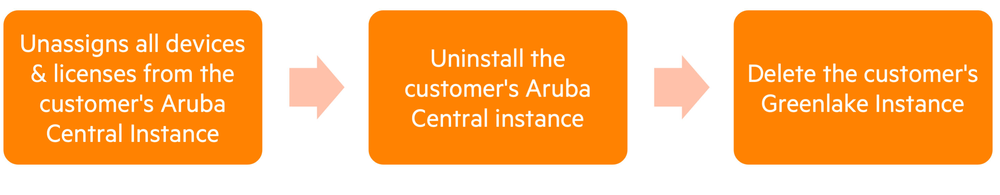
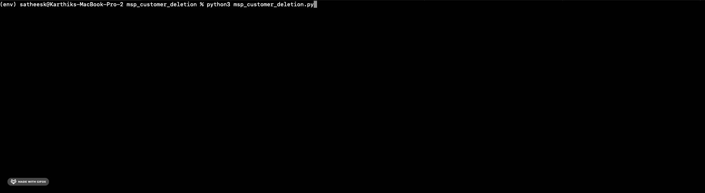

# MSP Customer Deletion
This is a Python script that uses the [Pycentral](https://pypi.org/project/pycentral/) library to automate the following steps on an Aruba Central account with [MSP mode](https://www.arubanetworks.com/techdocs/central/latest/content/nms/msp/overview.htm)- 
1. Unassigns all devices & licenses within the customer's Aruba Central Instance. The devices & licenses will be moved back to the MSP's inventory.
2. Uninstall the customer's Aruba Central instance
3. Delete the customer's Greenlake Instance


## Installation Steps
In order to run the script, please complete the steps below:
1. Clone this repository and `cd` into the workflow directory:
    ```bash
    git clone https://github.hpe.com/hpe/central-python-workflows
    cd central-python-workflows/msp_customer_deletion
    ```
   
2. Install virtual environment (refer https://docs.python.org/3/library/venv.html). Make sure python version 3 is installed in system.
    ```bash
    python -m venv env
    ```

3. Activate the virtual environment
    In Mac/Linux:
    ```bash
    source env/bin/activate
    ```
    In Windows:
    ```bash
    env/Scripts/activate.bat
    ```
4. Install the packages required for the script
    ```bash
    python -m pip install -r requirements.txt
    ```
5. Provide the Central API Gateway Base URL & Access Token in the [central_token.json](central_token.json)
    ```json
    {
        "central_info": {
            "base_url": "<api-gateway-domain-url>",
            "token": {
                "access_token": "<api-gateway-access-token>"
            }
        },
        "ssl_verify": true
    }
    ```
    **Note**
   - [BaseURLs of Aruba Central Clusters](https://developer.arubanetworks.com/aruba-central/docs/api-oauth-access-token#table-domain-urls-for-api-gateway-access)
   - [Generating Access token from Central UI](https://developer.arubanetworks.com/aruba-central/docs/api-gateway-creating-application-token)
   - [Generating Access token using OAuth APIs](https://developer.arubanetworks.com/aruba-central/docs/api-oauth-access-token)
6. Fill up the [workflow_variables.json](workflow_variables.json) file with the name or id of the customer(s) you would like to delete from the MSP account.
7. Once **central_token.json** & **workflow_variables.json** are updated with the relevant information, you can execute the script with the following command:
   ```bash
    python msp_customer_deletion.py
    ```
    **Note**  
    - This script takes the following optional parameters to overide default filenames for the script
      - central_auth - Path of Central Token File
      - workflow_variables - Path of Workflows Variables File  
    - ou can run the following command to use the optional parameters -
     ```bash
    python msp_customer_onboarding.py --central_auth <central_token_file> --workflow_variables <workflow_variables_file>
8. If the script runs successfully, your terminal output should look like this -
<p align="center">
    
</p>

## Central APIs used for this workflow - 
1. [Get list of customers under the MSP account](https://developer.arubanetworks.com/aruba-central/reference/apiviewsmsp_apiget_customers)
2. [Un-assign all devices from Tenant/end-customer](https://developer.arubanetworks.com/aruba-central/reference/apiviewsmsp_apiunassign_tenant_devices)
3. [Delete a customer](https://developer.arubanetworks.com/aruba-central/reference/apiviewsmsp_apidelete_customer)