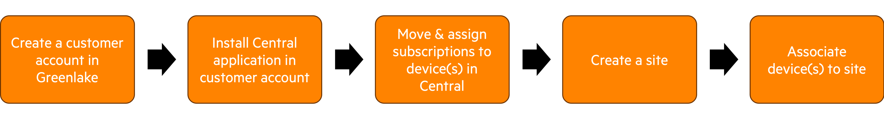
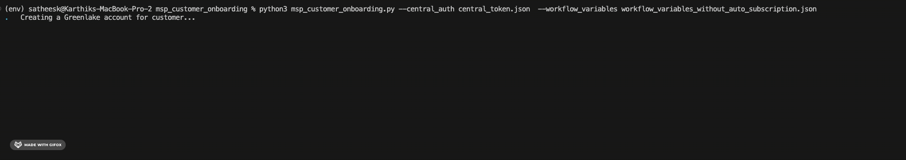

# MSP Customer Onboarding
This is a Python script that uses the [Pycentral](https://pypi.org/project/pycentral/) library to achieve the following steps on an Aruba Central account with [MSP mode](https://www.arubanetworks.com/techdocs/central/latest/content/nms/msp/overview.htm)- 
1. Create a customer account within the Greenlake MSP account
2. Install an Aruba Central instance in the customer account & set the default group
3. Move & assign subscriptions to devices in the customer's Central Instance
4. Optional Steps
   1. Create a Site in the customer's Central instance
   2. Move Devices to the newly created Site.


## Prerequisite
1. The Aruba Central application is installed in the Greenlake MSP account.
2. The name of the customer being created is unique across the Greenlake platform.
3. The devices used in the workflow are not assigned to any application in the Greenlake account and do not have any subscriptions associated with them.
4. The subscription that the workflow utilizes is not expired and has open seats for assignment.

## Installation Steps
In order to run the script, please complete the steps below:
1. Clone this repository and `cd` into the workflow directory:
    ```bash
    git clone https://github.hpe.com/hpe/central-python-workflows
    cd central-python-workflows/msp_customer_onboarding
    ```
   
2. Install virtual environment (refer https://docs.python.org/3/library/venv.html). Make sure python version 3 is installed in system.
    ```bash
    python -m venv env
    ```

3. Activate the virtual environment
    In Mac/Linux:
    ```bash
    source env/bin/activate
    ```
    In Windows:
    ```bash
    env/Scripts/activate.bat
    ```
4. Install the packages required for the script
    ```bash
    python -m pip install -r requirements.txt
    ```
5. Provide the Central API Gateway Base URL & Access Token in the [central_token.json](central_token.json)
    ```json
    {
        "central_info": {
            "base_url": "<api-gateway-domain-url>",
            "token": {
                "access_token": "<api-gateway-access-token>"
            }
        },
        "ssl_verify": true
    }
    ```
    **Note**
   - [BaseURLs of Aruba Central Clusters](https://developer.arubanetworks.com/aruba-central/docs/api-oauth-access-token#table-domain-urls-for-api-gateway-access)
   - [Generating Access token from Central UI](https://developer.arubanetworks.com/aruba-central/docs/api-gateway-creating-application-token)
   - [Generating Access token using OAuth APIs](https://developer.arubanetworks.com/aruba-central/docs/api-oauth-access-token)
6. Provide the Customer, Subscription, Device, and Site details in workflow_variables.json. This script provides the user the ability to assign subscriptions to the customer's devices using two options - 
- With Auto Subscription -> With this option, users can specify the services/subscriptions that need to be auto-enabled for this customer. This ensures that any devices that are assigned to the customer's Central instance would get assigned a subscription from the pool of auto-enabled subscriptions. Check out the below sample [workflow_variables.json](workflow_variables_auto_subscription.json) to understand how to provide workflow details with auto subscription
```json
   {
    "customer_details": {
        "name": "<customer-name>",
        "group_name": "<default-group>",
        "address": {
            "street_address": "<street-address>",
            "city": "<city>",
            "state": "<state>",
            "zip_postal_code": "<zip>",
            "country": "<country>"
        },
        "description": "<description>",
        "lock_ssids": "<enable-disable-ssid>",
    },
    "auto_subscription": [
        "<central-services-1>",
        "<central-services-2>",
        "<central-services-3>"
    ],
    "device_details": {
        "SWITCH": {
            "<device-serial-1>": {
                "mac_address": "<device-mac-address-1>"
            }
        },
        "IAP": {
            "<device-serial-2>": {
                "mac_address": "<device-mac-address-2>"
            }
        }
    },
    "site_details": {
        "site_name": "<site-name>",
        "site_address": {
            "address": "",
            "city": "",
            "state": "",
            "country": "",
            "zipcode": ""
        }
    }
}
```

- Without Auto Subscription -> With this option, users have to specify the subscription that needs to be assigned for each device  that gets moved to the customer's Central instance. Check out the below sample [workflow_variables.json](workflow_variables_without_auto_subscription.json) to understand how to provide workflow details without auto subscription.
```json
   {
    "customer_details": {
        "name": "<customer-name>",
        "group_name": "<default-group>",
        "address": {
            "street_address": "<street-address>",
            "city": "<city>",
            "state": "<state>",
            "zip_postal_code": "<zip>",
            "country": "<country>"
        },
        "description": "<description>",
        "lock_ssids": "<enable-disable-ssid>"
    },
    "device_details": {
        "SWITCH": {
            "<device-serial-1>": {
                "mac_address": "<device-mac-address-1>",
                "central_subscription": "<subscription-type-for-device-1>"
            }
        },
        "IAP": {
            "<device-serial-2>": {
                "mac_address": "<device-mac-address-2>",
                "central_subscription": "<subscription-type-for-device-2>"
            }
        }
    },
    "site_details": {
        "site_name": "<site-name>",
        "site_address": {
            "address": "",
            "city": "",
            "state": "",
            "country": "",
            "zipcode": ""
        }
    }
}
```
7. Once **central_token.json** & **workflow_variables.json** are updated with the relevant information, you can execute the script with the following command:
   ```bash
    python msp_customer_onboarding.py
    ```
    **Note**  
    - This script takes the following optional parameters to overide default filenames for the script
      - central_auth - Path of Central Token File
      - workflow_variables - Path of Workflows Variables File  
    - If you would like to use the auto subscription option, you can add the following parameter
      - auto_subscription - Auto Subscription Option(Boolean)
    - You can run the following command to use the optional parameters -
     ```bash
    python msp_customer_onboarding.py --central_auth <central_token_file> --workflow_variables <workflow_variables_file> --auto_subscription
    ```
8. If the script runs successfully, your terminal output should look like this -
   1. With Auto Subscription
    <p align="center">
        
    </p>
   2. Without Auto Subscription
    <p align="center">
        
    </p>


## Central APIs used for this workflow - 
1. [Create a new customer](https://developer.arubanetworks.com/aruba-central/reference/apiviewsmsp_apicreate_customer_v2)
2. [Get list of customers under the MSP account based on limit and offset](https://developer.arubanetworks.com/aruba-central/reference/apiviewsmsp_apiget_customers)
3. [Move a device to an end-customer](https://developer.arubanetworks.com/aruba-central/reference/apiviewsmsp_apimove_devices_to_customer)
4. [Enable auto license settings and assign services to all devices owned by tenant customers](https://developer.arubanetworks.com/aruba-central/reference/acp_servicelicensewebviewsadmin_licenseapigw_msp_enable_auto_licensing_settings-1)
5. [Assign subscription to a device](https://developer.arubanetworks.com/aruba-central/reference/acp_servicelicensewebviewsadmin_licenseapigw_assign_licenses-1)
6. [Get list of devices and licenses under the Customer account](https://developer.arubanetworks.com/aruba-central/reference/apiviewsmsp_apiget_customer_devices)
7. [Create Site](https://developer.arubanetworks.com/aruba-central/reference/sitesexternal_controllercreate_site)
8. [Associate Site to a list of devices](https://developer.arubanetworks.com/aruba-central/reference/sitesexternal_controllerassign_site_to_devices)