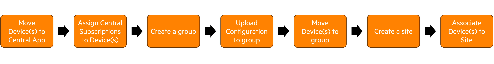
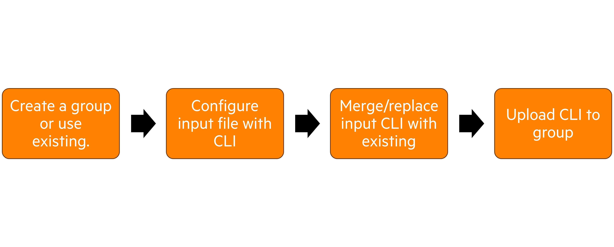

# central-python-workflows

This repository contains Python based workflows & code samples that utilize [Aruba Central's automation capabilities](https://developer.arubanetworks.com/aruba-central/docs/aruba-central-extensibility) and the Python SDK [pycentral](https://pypi.org/project/pycentral/)

## Aruba Central REST APIs
- [Device Provisioning](device_provisioning/)\
   
- [Device Onboarding](device_onboarding/)\
  
- [MSP Customer Onboarding](msp_customer_onboarding/)\
  
- [Inventory to Excel Workflows](inventory_to_excel/)\
  This workflow creates excel files populated with device details from devices currently in inventory.
- [AP CLI Workflows](ap_config/)\
  
- [Postman Collections](Postman-Collections/)\
  Postman is a popular tool to test and make HTTP Requests to API endpoints. This folder contains Postman collections in JSON format for Aruba Central REST APIs.

To manage REST APIs in Aruba Central, go to `MAINTAIN -> ORGANIZATION -> PLATFORM INTEGRATION -> REST API`.\
Learn more about Aruba Central REST APIs [here](https://developer.arubanetworks.com/aruba-central/docs/api-getting-started).

## Aruba Central Streaming API
- [Streaming API Websocket Client Application](streaming-api-client/)\
The sample script in this section contains sample websocket client application based on python. 
The sample python script would establish a websocket connection and decode the google protobuf message to human readable format.

To manage Streaming APIs in Aruba Central, go to `MAINTAIN -> ORGANIZATION -> PLATFORM INTEGRATION -> STREAMING`.\
Learn more about Aruba Central Streaming APIs [here](https://developer.arubanetworks.com/aruba-central/docs/streaming-api-getting-started).

## Aruba Central Webhooks

- [Webhook Client application](webhooks/)\
The sample script in this section would start a HTTP(s) client to receive Alerts from Aruba Central via webhooks. 

To manage Webhooks in Aruba Central, go to `MAINTAIN -> ORGANIZATION -> PLATFORM INTEGRATION -> WEBHOOKS`.\
Learn more about Aruba Central Webhooks [here](https://developer.arubanetworks.com/aruba-central/docs/webhooks-getting-started).

For more information about Aruba Central, [refer here](https://www.arubanetworks.com/techdocs/central/latest/content/home.htm)
