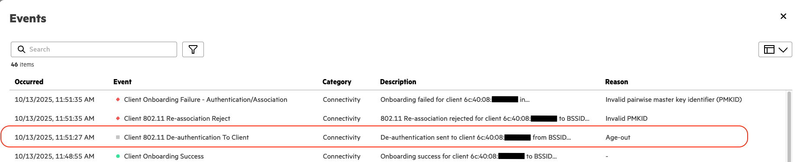

# Client Disconnection

This workflow automates the process of disconnecting a client device from a network managed by HPE Aruba Networking Central.
The user provides a client MAC address, and the workflow:
1. Fetches the client's details (site, connected device, connection state) directly using the client's MAC address
2. Sends a disconnect request to the device the client is connected to

<div align="center">
  
  <p><em>Client Disconnect Workflow Overview</em></p>
</div>

## Prerequisites

The following conditions must be met before running this workflow:

- API credentials must have sufficient permissions for client management operations
- Client devices must be currently connected to the network managed by Central
- Client MAC addresses must be known and valid

## Installation

Set up a Python virtual environment, activate it, and install dependencies from `requirements.txt`

1. Clone the repository and navigate to this workflow folder
```bash
git clone -b v2 https://github.com/aruba/central-python-workflows.git
cd central-python-workflows/client-disconnection
```

2. Create and activate a virtual environment, then install dependencies
- On macOS/Linux: source venv/bin/activate
- On Windows (PowerShell): venv\Scripts\Activate.ps1

```bash
python3 -m venv venv
source venv/bin/activate  # On Windows use: venv\Scripts\activate
pip install -r requirements.txt
```

This workflow is tested on the `pycentral` SDK (version: `2.0a14`). Please check compatibility before executing on older/newer versions as there may be changes.

## Configuration

### Credentials Configuration (account_credentials.yaml)

For API operations in new HPE Aruba Networking Central:

```yaml
new_central:
    cluster_name: <cluster-name>  # or base_url: <central-api-base-url>
    client_id: <new-central-client-id>
    client_secret: <new-central-client-secret>
```
**Sample Input:** See [`account_credentials.yaml`](./account_credentials.yaml) in this repository for an example credential file.


> [!TIP]
> **Where to find these:**
> - [Central API Gateway Base URLs](https://developer.arubanetworks.com/new-hpe-anw-central/docs/getting-started-with-rest-apis#api-gateway-base-urls) 
> - [How to get API Credentials for new Central](https://developer.arubanetworks.com/new-hpe-anw-central/docs/generating-and-managing-access-tokens) 


### Workflow Input Data (workflow_variables.yaml)

```yaml
client_macs:
  - aa:bb:cc:dd:ee:ff
  - 11:22:33:44:55:66
```

| Parameter | Type | Required | Description |
|-----------|------|----------|-------------|
| `client_macs` | list of strings | Yes | List of client MAC addresses to disconnect |


**Sample Input:** See [`workflow_variables.yaml`](./workflow_variables.yaml) in this repository for an example input file structure.

## Execution

When you run the script, it processes clients listed in the input file concurrently (up to `--max_workers` at a time, default: 5) and performs the following operations for each client:
1. **Client Detail Fetch**: Retrieves the client's connection details (site, connected device, and connection state) directly using the client's MAC address.
2. **Connection State Check**: If the client is not currently connected, the disconnection is skipped and recorded as `SKIPPED`.
3. **Disconnection Request**: Sends a disconnection command to the corresponding device (Access Point or Gateway) managing that client.
4. **Results Export**: Generates a comprehensive report summarizing the disconnection request status and related details for all processed clients.

```bash
python client_disconnect.py -vars workflow_variables.yaml -c account_credentials.yaml
```

### Command Line Options

| Name        | Type   | Description           | Required |
|-------------|--------|----------------------|----------|
| `-c, --credentials` | string | Path to YAML/JSON file with Central credentials | Yes |
| `-vars, --variables_file` | string | Path to YAML/JSON file containing client MAC addresses | Yes |
| `--max_workers` | int | Maximum number of clients to process concurrently (default: 5) | No |

## Output

The workflow produces detailed results both in terminal output and CSV export:

### Terminal Output
- Real-time progress updates for each client
- Tabulated summary showing disconnection results
- Error messages and troubleshooting information
- Colored Rows indicating status of client disconnection.
	- Green indicates that the client disconnection was initiated successfully.
	- Yellow indicates that the client disconnection was skipped. The reason for skipping (for example, client not currently connected) is shown in the Errors column.
	- Red indicates that the client disconnection failed. The detailed error or failure reason is displayed in the Errors column.

**Sample Output:** See below for a sample terminal output of the script.


### CSV Export
A timestamped CSV file (`client_disconnect_results_YYYYMMDD_HHMMSS.csv`) containing:

| Column | Description |
|--------|-------------|
| Client MAC | MAC address of the client |
| Client Name | Name of the client |
| Connected Site | Site where the client was connected |
| Connected Device | Device (AP/Gateway) the client was connected to |
| Disconnect Status | SUCCESS/FAILED/SKIPPED for disconnection attempt |
| Errors | Error messages if any step failed |
| Overall Status | SUCCESS/FAILED overall workflow result |

**Sample Output:** See [`client_disconnect_results_sample.csv`](./client_disconnect_results_sample.csv) in this repository for an example output file.

### Verification of Disconnection

> [!NOTE]
> The disconnection attempt is initiated by the workflow but not guaranteed to complete automatically. The workflow sends a disconnect command to the device managing the client, but depending on network conditions, device response, and client type, the action may not always take effect immediately.

To confirm a successful disconnection, verify the client’s status in the Central UI. See the screenshot below for an example of how a successful disconnection event appears in the Client's Event tab in Central UI.
To confirm that the disconnection request was successful, follow these steps:
1.	Navigate to the site where the client was associated.
2.	Go to the Clients section and check the client’s current connection status.
    - If the client is disconnected, the action succeeded.
    - In some cases, the client may still appear as connected in the list due to network delays or UI refresh intervals.
3.	Regardless of the connection state, you can confirm the action by navigating to the **Event** tab of the client in Central. A successful disconnection event will be recorded here, as shown in the example below.
<div align="center">
  
  <p><em>Successful client disconnection event as shown in the Client’s Event tab in Central.</em></p>
</div>

## Troubleshooting

- Verify API credentials are valid and not expired
- Check that the cluster name or base URL is correct
- Verify client MAC addresses are correct and properly formatted
- Ensure clients are currently connected to the network

## Support

- **Automation Team**: [aruba-automation@hpe.com](mailto:aruba-automation@hpe.com)
- **Workflow Issues**: [GitHub Issues](https://github.com/aruba/central-python-workflows/issues)
- **PyCentral Library**: [PyCentral Issues](https://github.com/aruba/pycentral/issues)
