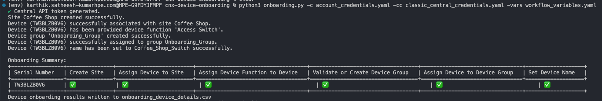

# Central Onboarding Script

This script automates onboarding of devices in HPE Aruba Networking Central to make them ready for configuration via **New Central**. It simplifies and sequences key onboarding steps needed after a device is added to the Central application.

> [!CAUTION]
> This script uses a beta version of the `pycentral` library and is designed for HPE Aruba New Central, which is also in Public Preview. Expect potential changes and updates to the API and functionality.

## What This Script Does

The script performs the following onboarding steps:

1. **Assign Device to Site**
   - A site name must be specified for each device.  
   - If the site exists: the device is assigned to it.  
   - If the site does not exist and additional site details (address, city, etc.) are provided: a new site is created automatically.

2. **Set Device Persona** 
   - Assigns the appropriate persona (e.g., Access Switch, Gateway, etc.) that defines the device’s function in the network.

3. **Assign Device to Device Group** 
   - If the New Central compatible device group name is specified and it exists: the device is assigned to that group.  
   - If the group doesn't exist but a name is provided: the script creates a **New Central-compatible** device group and assigns the device.  

4. **Set Device Name** (Optional)  
   - If a device name is provided in the input file, the script will set the device’s name in Central.

---

## Prerequisites

- Devices must already be **assigned** and **subscribed** to an **HPE Aruba Networking Central Instance**.
- Devices should be in a **factory-default state** (i.e., freshly added to Central with no existing site or device group associations).
- Python 3.8 or higher must be installed.

---

## Setting Up

Clone this repository and `cd` into the workflow directory:
```bash
git clone -b "v2(pre-release)" https://github.com/aruba/central-python-workflows.git
cd central-python-workflows/cnx-device-onboarding
```
   
Create and activate a virtual environment:
```bash
python3 -m venv venv
source venv/bin/activate  # On Windows: venv\Scripts\activate
```

Install the required packages:
```bash
pip install -r requirements.txt
```

## Input Files

The following input files are required (in JSON or YAML format):

### 1. **New Central Credentials File**
Contains Central API credentials in JSON or YAML format.
Example (YAML):
```yaml
central:
    # Either `base_url` or `cluster_name` should be provided:
    # 
    # base_url: <central-api-base-url>
    # cluster_name: <central-cluster-name>
    client_id: <central-client-id>
    client_secret: <central-client-secret>
```
> [!NOTE]
> To locate the `cluster_name`(E.g. **EU-1**) or `base_url`(E.g. **de1.api.central.arubanetworks.com**) of your New Central cluster refer to [API Gateway Base URLs on our Developer Hub](https://developer.arubanetworks.com/new-central/docs/getting-started-with-rest-apis#api-gateway-base-urls).\
> To obtain your API credentials, please refer to: [Generating and Managing Access Tokens](https://developer.arubanetworks.com/new-central/docs/generating-and-managing-access-tokens)\


### 2. **Classic Central Credentials File**
Some of the onboarding steps currently require Classic Central APIs. Provide credentials in the following format:

```yaml
central_info:
  base_url: <classic_central_base_url>
  token:
    access_token: <classic_central_access_token>
  ssl_verify: true
```
> To get `base_url` of your Classic Central cluster, refer to [Base URLs of Classic Central Clusters](https://developer.arubanetworks.com/central/docs/api-oauth-access-token#table-domain-urls-for-api-gateway-access)\
> To obtain your Classic Central access token, refer to [Generating Access token from Central UI](https://developer.arubanetworks.com/central/docs/api-gateway-creating-application-token) or [Generating Access token using OAuth APIs](https://developer.arubanetworks.com/central/docs/api-oauth-access-token)

### 3. **Device Data File**
Defines the devices to be onboarded and their assignment properties.

```yaml
devices:
  - serial_number: <serial-number>
    type: <device_type>
    device_function: Access Switch
    site: Random Site 
    device_group: Onboarding_Group
    name: Random_Switch

# OPTIONAL: Only provide if site needs to be created
site:
  name: Random Site
  address: 8000 Foothills Blvd
  city: Roseville
  state: California
  country: United States
  zipcode: "95747"
  timezone: America/Los_Angeles
```

- `serial_number`: Device serial number.
- `type`: Device Type. Supported Device Type - AP, SWITCH, GATEWAY
- `device_function`: Specifies device function. Supported Device Functions - 
  - AP - **Campus AP**
  - SWITCH - **Access Switch, Core Switch, Aggregation Switch**
  - GATEWAY - **Mobility Gateway**
- `site`: Site name. If the site does not exist, & site details are provided in input file, the site will be created. The device will be assigned to the site
- `device_group`: If group exists, device is added. If not, and a group name is provided, a New Central-compatible group is created & device is assigned to it.
- `name`: Optional — Device name to be set in Central.

Sample input files are provided in the [sample-input](sample-input/) directory.
---

## Running the Script

Run the script using the command below:

```bash
python3 onboarding.py -c account_credentials.yaml -cc classic_central_credentials.yaml -vars workflow_variables.yaml
```
## Output
At the end, a summary table is printed in the terminal and a detailed CSV (`onboarding_results.csv`) is generated. 
- **Terminal Table**: Shows a checkmark for success and a cross for failure for each device and step. Below is an example of the terminal output when running the script:
  
- **CSV File**: Contains detailed results for each device called `onboarding_results.csv` (See example output CSV [here](sample-output/onboarding_results.csv))

## Troubleshooting
- Ensure your credentials and input files are valid and in JSON or YAML format.
- If you encounter any issues with the script, please contact the [Automation team](mailto:aruba-automation@hpe.com) or report it via [GitHub Issues](https://github.com/aruba/central-python-workflows/issues) .
- For PyCentral-v2 issues, report bugs via [GitHub Issues](https://github.com/aruba/pycentral/issues).
