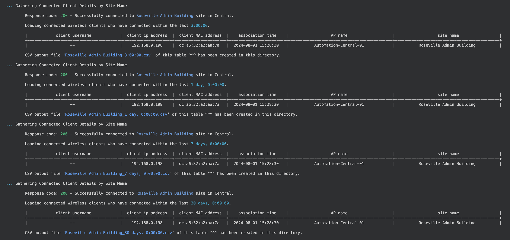

# Connected Clients
This is a Python script that uses the [Pycentral](https://pypi.org/project/pycentral/) library to achieve the following steps on an HPE Aruba Networking Central account- 
1. Gather connected client information based on site name and time frame
2. Output csv files are generated and created within workflow folder

## Guide
A comprehensive guide has been made for this workflow and can be referenced [here](https://developer.arubanetworks.com/hpe-aruba-networking-central/docs/connected-clients) on our HPE Aruba Networking Developer Hub

## Prerequisites
1. Connected Clients need to be online and connected

## Installation Steps
In order to run the script, please complete the steps below:
1. Clone this repository and `cd` into the workflow directory:
    ```bash
    git clone https://github.com/aruba/central-python-workflows
    cd central-python-workflows/connected_clients
    ```
   
2. Install virtual environment (refer https://docs.python.org/3/library/venv.html). Make sure python version 3 is installed in system.
    ```bash
    python -m venv env
    ```

3. Activate the virtual environment
    In Mac/Linux:
    ```bash
    source env/bin/activate
    ```
    In Windows:
    ```bash
    env/Scripts/activate.bat
    ```

4. Install the packages required for the script
    ```bash
    python -m pip install -r requirements.txt
    ```

5. Provide the Central API Gateway Base URL & Access Token in the [central_token.json](central_token.json)
    ```json
    {
        "central_info": {
            "base_url": "<api-gateway-domain-url>",
            "token": {
                "access_token": "<api-gateway-access-token>"
            }
        },
        "ssl_verify": true
    }
    ```
    **Note**
   - [BaseURLs of Aruba Central Clusters](https://developer.arubanetworks.com/aruba-central/docs/api-oauth-access-token#table-domain-urls-for-api-gateway-access)
   - [Generating Access token from Central UI](https://developer.arubanetworks.com/aruba-central/docs/api-gateway-creating-application-token)
   - [Generating Access token using OAuth APIs](https://developer.arubanetworks.com/aruba-central/docs/api-oauth-access-token)

6. Provide a one or more site names into the string list array in the [site_names.json](site_names.json)
    ```json
    {
        "site_names": [
            "<site name>",
            "<site name>"
        ]
    }
    ```
7. The default timeframes preset within this script are 3 hours, 24 hours, 1 week, and 1 month. The "timeframe" list variable within the connected_clients.py file is responsible for using all of those preset variables. If you would only like the see connected clients that connected last within just one week, you can make one_week_ago the only item within the "timeframe" list variable.  Otherwise if no changes are made, the connected_clients.py script will output the 4 default timeframes.
    ```bash
    # timeframe = [one_day_ago, one_week_ago]
    # timeframe = [one_week_ago]
    # timeframe = [one_month_ago]
    timeframe = [three_hours_ago, one_day_ago, one_week_ago, one_month_ago]
    ```
  
8. Once **central_token.json** & **site_names.json** are updated with the relevant information, you can execute the script with the following command:
   ```bash
    python connected_clients.py
    ```
    **Note**  
    - This script takes the following optional parameter to overide central auth file name
      - central_auth - Path of Central Token File
    - You can run the following command to use the optional parameter -
     ```bash
    python connected_clients.py --central_auth <central_token_file>
    ```

9. If the script runs successfully, your terminal output should look like this -
    <p align="center">
        
    </p>

10. Depending on the site name and time frame inputs, one or more output csv files will be created with the output of the script results
   - Columns will consist of: 'Client Username', 'Client IP Address', 'Client MAC Address', 'Association Time', 'AP Name', 'Site Name'
   ```csv
    Generated:,2024-08-01 16:45:00.730098
    Report By:,Site
    Site Name:,Roseville Admin Building
    Reporting Period:,"30 days, 0:00:00"
    ""
    Client Username,Client IP Address,Client MAC Address,Association Time,AP Name,Site Name
    --,192.168.0.198,dc:a6:32:a2:aa:7a,2024-08-01 15:28:30,Automation-Central-01,Roseville Admin Building
   ```

## Central APIs used for this workflow - 
1. [List Connected Wireless Clients](https://developer.arubanetworks.com/hpe-aruba-networking-central/reference/apiexternal_controllerget_wireless_clients)
2. [List Connected Wired Clients](https://developer.arubanetworks.com/hpe-aruba-networking-central/reference/apiexternal_controllerget_wired_clients)