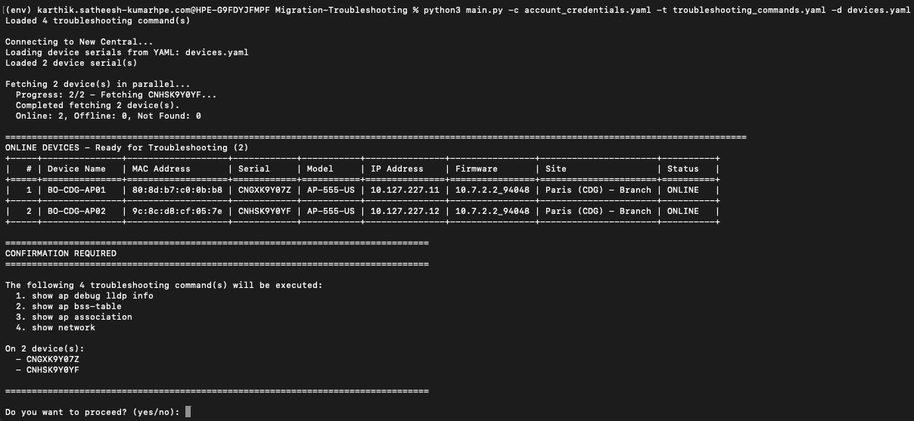
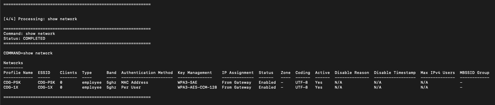
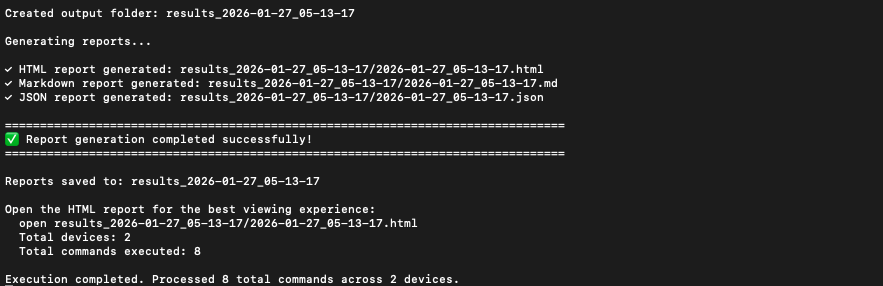

# Cutover Validation

This script is intended to run a predefined set of troubleshooting show commands across Central devices.

In scenarios such as onboarding to Central, migrating from AOS 8 to AOS 10, migrating from Classic Central to Central or other environment transitions, it is common to run the same operational checks across multiple devices, often scoped to a site or a specific device list.

The script automates this process by allowing you to execute those show commands consistently and repeatedly without manually logging into individual devices.

Commands are executed only on online devices, and results are collected for review and analysis. The output can be generated in multiple formats, including JSON, HTML, and Markdown, making it suitable for programmatic consumption, documentation, or sharing with other teams.


## Features

- **Command Validation** - Validates commands against device capabilities before execution
- **Batched Command Execution** - Executes up to 20 commands per device in a single `run_show_commands` API call
- **Multiple Input Formats** - Support for both YAML and CSV device lists
- **Flexible Configuration** - Separate troubleshooting commands from device lists
- **Comprehensive Reporting** - Generates JSON, HTML, and Markdown reports with timestamps
- **Site-Based Filtering** - Select devices by site for targeted troubleshooting
- **Detailed Logging** - Real-time execution status and error tracking

## Prerequisites

- Python 3.8 or higher
- API credentials for HPE Aruba Networking Central (JSON or YAML format)

## Installation

1. Clone the repository and navigate to the project folder
```bash
git clone -b "v2(pre-release)" https://github.com/aruba/central-python-workflows.git
cd cutover-validation
```

2. Create and activate a virtual environment
```bash
python3 -m venv env
source env/bin/activate  # On Windows use: env\Scripts\activate
```

3. Install dependencies
```bash
pip install -r requirements.txt
```

This workflow is tested with the `pycentral` SDK version `2.0a14`. Please check compatibility before executing on newer versions as there may be changes.

## Configuration

### Credentials Configuration

Create an `account_credentials.yaml` file with your new Central API credentials:

```yaml
new_central:
    base_url: <central-api-base-url>
    client_id: <new-central-client-id>
    client_secret: <new-central-client-secret>
```

**Sample Input:** See [`account_credentials.yaml`](./account_credentials.yaml) in this repository for an example credential file.

> [!TIP]
> **Where to find these:**
> - [Central API Gateway Base URLs](https://developer.arubanetworks.com/new-central/docs/getting-started-with-rest-apis#api-gateway-base-urls) 
> - [How to get API Credentials for new Central](https://developer.arubanetworks.com/new-central/docs/generating-and-managing-access-tokens)

### Workflow Input Data

The script requires a troubleshooting commands file and provides three flexible ways to select devices.

#### Troubleshooting Commands File (Required)

The troubleshooting commands file specifies which show commands will be executed on the selected devices. This file is always required.

> [!IMPORTANT]
> This workflow supports a maximum of **20 troubleshooting commands** per run.

##### troubleshooting_commands.yaml
```yaml
commands:
  - show ap debug lldp neighbor
  - show ap bss-table
  - show ap association
  - show network
```

**Sample Input:** See [`troubleshooting_commands.yaml`](./troubleshooting_commands.yaml) in this repository.

#### Device Selection Methods

You have **three ways** to select which devices to run troubleshooting commands on:

##### Method 1: No Device File - Site-Based Selection (Easiest)

Don't provide any device file. The script will display all available sites and let you select one. It will then run troubleshooting commands on **all online APs** at the selected site.

**When to use:** Quick troubleshooting of all APs at a specific site location.

##### Method 2: Device YAML File - Specific Device List

Provide a YAML file with a list of device serial numbers. Only these specific devices will be used.

**devices.yaml**
```yaml
devices:
  - SERIAL123456
  - SERIAL789012
  - SERIAL345678
```

**Sample Input:** See [`devices.yaml`](./devices.yaml) in this repository.

**When to use:** Targeting specific devices across multiple sites or groups.

##### Method 3: CSV File - Valid8 Tool Output

Provide a CSV file in the format output by the Valid8 tool. The script will automatically extract device serial numbers and run troubleshooting commands on devices that are **online**.

**Example CSV format (valid_8_output.csv):**
```csv
Serial_No,MAC_Address,tag:name1,tag:name2,Location_Name (Optional),Contact_Id
SERIAL123456,1x:28:xx:xx:xx:xx16,,,,
SERIAL789012,3x:xx:xx:xx:xx:xx,,,,
SERIAL345678,9x:xx:xx:xx:xx:xx,,,,
```

**Sample Input:** See [`valid_8_output.csv`](./valid_8_output.csv) in this repository.

The script automatically detects the serial number column. Supported column names:
- `Serial_No`, `serial`, `serial_number`, `device_serial`, `serialnumber`, `serial number`

If no matching column is found, it uses the first column.

**When to use:** You have Valid8 tool output and want to troubleshoot those specific devices.

## Execution

Once you have setup the configuration files, you can run troubleshooting commands on your devices by running the following command:

```bash
python3 main.py -c account_credentials.yaml -t troubleshooting_commands.yaml
```

The script processes each device through these steps:

1. **Input Validation** - Validates configuration file structure and credentials
2. **Device Discovery** - Fetches devices from Central (optionally filtered by site)
3. **Command Validation** - Validates commands against each device's capabilities
4. **Command Execution** - Executes valid commands in a single batch per device using `run_show_commands` (up to 20 commands), processing up to 5 devices in parallel
5. **Report Generation** - Generates JSON, HTML, and Markdown reports

**If something fails:** The script skips invalid commands for that device and continues with the next command/device to avoid cascading failures.

### Command Line Options

| Flag | Type | Description | Required |
|------|-------|------|----------|
| `-c, --credentials` | string | Central API credentials file (YAML) | Yes |
| `-t, --troubleshooting_commands` | string | YAML file with commands to run on all devices | Yes |
| `-d, --devices` | string | YAML or CSV file containing device serial numbers | No |
| `--max-workers` | int | Maximum number of devices to process concurrently (default: 5) | No |

\* **Device Selection**: If you don't provide `-d`, the script will display available sites and let you select one to run commands on all online APs at that site.

### Usage Examples

#### Example 1: Site-based troubleshooting (no device file)
```bash
python3 main.py \
  -c account_credentials.yaml \
  -t troubleshooting_commands.yaml
```
The script will display available sites for you to select, then run commands on all online APs at that site.

#### Example 2: Run troubleshooting on specific devices from YAML
```bash
python3 main.py \
  -c account_credentials.yaml \
  -d devices.yaml \
  -t troubleshooting_commands.yaml
```

#### Example 3: Run troubleshooting on devices from Valid8 CSV output
```bash
python3 main.py \
  -c account_credentials.yaml \
  -d valid_8_output.csv \
  -t troubleshooting_commands.yaml
```

## Output

### On-Screen Output

The tool provides clear, structured terminal output to help users understand **what will run, what is running, and what was generated**.

#### 1. Execution Preview & Confirmation

Before any troubleshooting commands are executed, the tool displays:
- Devices identified for troubleshooting
- A summary table with device details
- The list of commands that will be executed

User confirmation is *required* before execution proceeds.



---

#### 2. Command Execution

Once confirmed, the tool executes the selected commands and shows:
- Live execution progress
- Per-device command status
- Success or failure indicators



---

#### 3. Report Generation Summary

After execution completes, the tool:
- Generates reports in multiple formats
- Displays the output directory
- Provides direct paths to generated reports




### Report Files

All outputs are saved in a timestamped directory.

- **HTML** – Interactive report for review and validation  
- **Markdown** – Documentation-friendly format  
- **JSON** – Structured output for automation and parsing

---

#### Sample Report Files

Example reports are available to help understand the structure and content of each format:

- **HTML:** [`sample_result_output/<timestamp>.html`](sample_result_output/2026-01-27_04-35-31.html)
- **Markdown:** [`sample_result_output/<timestamp>.md`](sample_result_output/2026-01-27_04-35-31.md)
- **JSON:** [`sample_result_output/<timestamp>.json`](sample_result_output/2026-01-27_04-35-31.json)

These samples reflect real execution output and include device details, executed commands, and collected responses.

## Troubleshooting

| Problem | Fix |
|---------|-----|
| **Bad credentials** | Check your API client ID, client secret & base_url in `account_credentials.yaml` |
| **Device not found** | Verify device serial numbers are correct and devices are in your Central account |
| **Command validation failed** | Commands may not be supported by the device type/model |
| **Connection timeout** | Ensure devices can reach Central and are online |
| **File errors** | Check YAML syntax in your configuration files (use a YAML validator) |

## Support

- **Automation Team**: [aruba-automation@hpe.com](mailto:aruba-automation@hpe.com)
- **Workflow Issues**: [GitHub Issues](https://github.com/aruba/central-python-workflows/issues)
- **PyCentral Library**: [PyCentral Issues](https://github.com/aruba/pycentral/issues)
