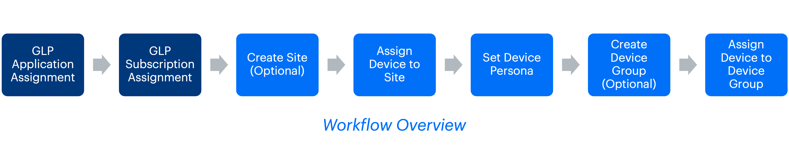

# Device Onboarding Workflow

This script automates the complete onboarding journey of factory-default devices in HPE Aruba Networking Central. It takes devices from an **unassigned state in GreenLake Platform (GLP)** through both GLP onboarding and Central onboarding to make them ready for configuration via **New Central**. 


**Phase 1: GLP (GreenLake Platform) Onboarding** *(Optional)*
- Takes unassigned devices in GLP and assigns them to HPE Aruba Networking Central application instances
- Applies subscription licenses using subscription keys to enable Central management

**Phase 2: Central Onboarding** *(Required)*
- Site creation and device assignment
- Device persona configuration
- Device group management and assignment
- Provisioning verification

> [!IMPORTANT]
> **For Central-only onboarding** (when skipping GLP onboarding): Devices must already be assigned to your Central application with valid subscriptions. They will typically be in the "default" group and should not be assigned to any site.

## Prerequisites

- Factory-default devices added to your GreenLake Platform account
- API credentials for both New Central and Classic Central
- Network connectivity between devices and Central
- If you have onboarded device to GLP & is only looking to onboard to Central, ensure that the devices are not assigned to any site & is in the default group

## Installation

1. Clone the repository and navigate to this workflow folder
```bash
git clone -b "v2(pre-release)" https://github.com/aruba/central-python-workflows.git
cd central-python-workflows/device-onboarding
```

2. Create and activate a virtual environment, then install dependencies
```bash
python3 -m venv venv
source venv/bin/activate  # On Windows use: venv\Scripts\activate
pip install -r requirements.txt
```

This workflow is tested on the `pycentral` SDK. Please check compatibility before executing on older/newer versions as there may be changes.

## Configuration

### Credentials Configuration

#### New HPE Aruba Networking Central & GLP Credentials (account_credentials.yaml)

For API operations in new HPE Aruba Networking Central & GLP:

```yaml
new_central:
    cluster_name: <cluster-name>  # or base_url: <central-api-base-url>
    client_id: <new-central-client-id>
    client_secret: <new-central-client-secret>
glp:
    client_id: <glp-client-id>
    client_secret: <glp-client-secret>
```
**Sample Input:** See [`account_credentials.yaml`](./account_credentials.yaml) in this repository for an example credential file.

> [!TIP]
> **Where to find these:**
> - [New Central API Gateway Base URLs](https://developer.arubanetworks.com/new-hpe-anw-central/docs/getting-started-with-rest-apis#api-gateway-base-urls) 
> - [How to get API Credentials for new Central](https://developer.arubanetworks.com/new-hpe-anw-central/docs/generating-and-managing-access-tokens)
> - [How to get API Credentials for GLP](https://developer.greenlake.hpe.com/docs/greenlake/guides/public/authentication/authentication#creating-a-personal-api-client)

#### Classic HPE Aruba Networking Central Credentials (classic_central_credentials.yaml)

For some operations that still require classic Central:

```yaml
central_info:
  base_url: <classic_central_base_url>
  token:
    access_token: <classic_central_access_token>
  ssl_verify: true
```
**Sample Input:** See [`classic_central_credentials.yaml`](./classic_central_credentials.yaml) in this repository for an example credential file.

> [!TIP]
> **Where to find these:**
> - [Classic Central API Gateway Base URLs](https://developer.arubanetworks.com/central/docs/api-oauth-access-token#table-domain-urls-for-api-gateway-access) 
> - [How to get an Access Token for classic Central](https://developer.arubanetworks.com/central/docs/access-token-management#obtain-access-token-via-web-ui)

### Workflow Input Data
The workflow requires input data to be defined in a YAML file. This includes details for devices, sites, and device groups. The following example files are available in the [`sample-input/`](sample-input/) directory:

- **[`complete_onboarding_variables.yaml`](sample-input/complete_onboarding_variables.yaml)** - Full example with GLP and Central onboarding for multiple devices
- **[`central_only_onboarding_variables.yaml`](sample-input/central_only_onboarding_variables.yaml)** - Central-only onboarding example (no GLP assignment)

Use these as templates for your own configuration files.

#### Sample Input File
```yaml
devices:
  - serial_number: <device-serial>
    # GLP Variables (Optional - only if GLP onboarding is required)
    application_assignment:
      name: <central-application-name>
      region: <region>
    subscription_assignment:
      key: <subscription-key>
    # Central Variables (Required)
    device_type: ACCESS_POINT  # or SWITCH, GATEWAY
    persona: Campus AP  # Device function
    device_group: <group-name>
    site: <site-name>

# Site details (optional - only if you need to create new sites)
sites:
  - name: <site-name>
    address: <address>
    city: <city>
    state: <state>
    country: <country>
    zipcode: "<zipcode>"
    timezone: <timezone>

# Device group details (optional - only if you need to create new groups)
device_groups:
  - group: <group-name>
    group_attributes:
      template_info:
        Wired: false
      group_properties:
        AllowedDevTypes:
          - AccessPoints
          - Switches
          - Gateways
        Architecture: AOS10
        ApNetworkRole: Standard
        GwNetworkRole: BranchGateway
        AllowedSwitchTypes:
          - AOS_CX
        NewCentral: true  # Required for New Central compatibility
```
#### Input File Breakdown
##### Devices(required)
| Parameter | Type | Required | Description |
|-----------|------|----------|-------------|
| `serial_number` | string | Yes | Device serial number |
| `device_type` | enum | Yes | `ACCESS_POINT`, `SWITCH`, or `GATEWAY` |
| `persona` | string | Yes | Device role (Campus AP, Access Switch, etc.). See section below for options |
| `device_group` | string | Yes | Target configuration group |
| `site` | string | Yes | Site assignment |
| `application_assignment` | object | No | GLP application details |
| `subscription_assignment` | object | No | GLP subscription details |

**Persona Options by Device Type:**
- **ACCESS_POINT**: Campus AP
- **SWITCH**: Access Switch, Core Switch, Aggregation Switch
- **GATEWAY**: Mobility Gateway

##### Sites (optional - only if you need to create sites)

Provide a complete site entry under the `sites` block when the workflow needs to create the site in Central. All fields in the table below are required for site creation. If the target site already exists in Central, you may omit that site's entry.

| Field    | Type   | Required | Description |
|----------|--------|----------|-------------|
| name     | string | Yes      | Unique site name (used for assignment). |
| address  | string | Yes      | Street address of the site. |
| city     | string | Yes      | City name. |
| state    | string | Yes      | State or region. |
| country  | string | Yes      | Country name or ISO code. |
| zipcode  | string | Yes      | Postal code (wrap in quotes). |
| timezone | string | Yes      | Timezone identifier (e.g., America/Chicago). |

##### Device Group (optional - only if you need to create device groups)

If device groups(New Central compatible groups) are needed to be created for the onboarding script, then please add device group details under the `device_groups` entry. If the device group already exists in Central, you may omit that device group's entry. 

## Usage

Once you have setup the configuration & input variables file, you can onboard your devices using the script. The script processes each device through these steps:

1. **Input Validation** - Validates configuration file structure
2. **GLP Onboarding (Optional)** - GLP Application and subscription assignment
3. **Central Onboarding**
   - Create Site (If site doesn't exist)
   - Assign Device to Site
   - Set Device Persona
   - Create Device Group (If device group doesn't exist)
   - Assign Device to Device Group 
4. **Verification** - Confirms provisioning status

**If something fails:** The script skips remaining steps for that device to avoid problems.

You can use the below command to run the script - 
```bash
python3 onboarding.py -c new_central_credentials.yaml -cc classic_central_credentials.yaml -vars workflow_variables.yaml
```

### Command Line Options

| Flag | Description | Required |
|------|-------------|----------|
| `-c, --credentials` | New Central API credentials | Yes |
| `-cc, --classic_credentials` | Classic Central API credentials | Yes |
| `-vars, --variables_file` | Device workflow configuration | Yes |

## Output

**On Screen:**
- Shows progress for each device and step
- Color-coded success/failure indicators
- Summary table at the end of script execution

**CSV File:**
Results saved to `onboarding_results_<timestamp>.csv` with:
- What happened for each device and step
- Error details if something failed

## Troubleshooting

| Problem | Fix |
|---------|-----|
| **Bad credentials** | Check your API tokens and permissions |
| **GLP errors** | Only include GLP credentials if you need them |
| **Device not responding** | Make sure device can reach Central |
| **File errors** | Check YAML syntax in your configuration files |

## Support

- **Automation Team**: [aruba-automation@hpe.com](mailto:aruba-automation@hpe.com)
- **Workflow Issues**: [GitHub Issues](https://github.com/aruba/central-python-workflows/issues)
- **PyCentral Library**: [PyCentral Issues](https://github.com/aruba/pycentral/issues)
