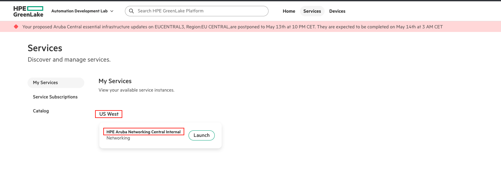

# Device Onboarding (GLP) Script

This script automates onboarding of devices to HPE GreenLake Cloud Platform (GLP) to HPE Aruba Networking Central using GLP API calls. It supports the following steps:
- Assigning devices to a Central application
- Applying subscriptions to devices

In addition to the Python script, a Postman collection is provided for this workflow. It includes all the necessary API calls required for device onboarding. This collection can be used as a reference or as an alternative to running the script. 

The Postman collection is located in the [`postman-collection`](Postman-Collection/) folder of this repository. It also includes an API call to add devices to the GLP workspace, which is not covered by the Python script.

### Prerequisites

- All devices must already be part of the HPE GreenLake Cloud Platform's device inventory.
- The application(eg. HPE Aruba Networking Central) to which devices will be assigned must already be installed/provisioned in the GLP account.
- The subscription key used for assignment must have enough available seats to accommodate the devices.

## Setting up the script

**Clone this repository and `cd` into the workflow directory:**
```bash
git clone -b "v2(pre-release)" https://github.com/aruba/central-python-workflows.git
cd central-python-workflows/glp-device-onboarding
```
**Create a virtual environment (recommended):**
```sh
python -m venv env
source env/bin/activate  # On Windows: env\Scripts\activate
```

**Install required packages:**
```bash
pip install -r requirements.txt
```

## Input Files

You need two input files:

1. **Credentials File**: Contains GLP API credentials (JSON or YAML). \
      
    Example File(YAML)
    ```yaml
    glp:
      client_id: <glp-client-id>
      client_secret: <glp-client-secret>
    ```
> [!NOTE]
> Input files can be in JSON or YAML format. Sample files are available in the `sample-input` folder of the repository: [JSON](sample-input/account_credentials.json), [YAML](sample-input/account_credentials.yaml) \
> You can find steps to get API Client Credentials for GLP Platform from [here](https://developer.greenlake.hpe.com/docs/greenlake/guides/public/authentication/authentication/#creating-a-personal-api-client)

1. **Input Data File**: Contains device, application, and subscription details (JSON or YAML).\
      
    Example File(YAML)
> [!TIP]
> To find the `application_name` and `region` required for application assignment, log in to the HPE GreenLake Platform. Navigate to the **Services** section, where you can view the application name and associated region. Refer to the screenshot below for guidance:
    
```yaml
      # Assign device to application (mandatory)
      application_assignment:
        - application_name: HPE Aruba Networking Central
          region: <region>
          device_serial_numbers:
            - <device-serial-number>
            - <device-serial-number>
        - application_name: HPE Aruba Networking Central
          region: <region>
          device_serial_numbers:
            - <device-serial-number>
            - <device-serial-number>

      # Assign subscription to device (mandatory)
      subscription_assignment:
        - subscription_key: <subscription-key>
          device_serial_numbers:
            - <device-serial-number>
        - subscription_key: <subscription-key>
          device_serial_numbers:
            - <device-serial-number>
```
> [!NOTE]
> Input files can be in JSON or YAML format. Sample files are available in the `sample-input` folder of the repository: [JSON](sample-input/workflow_variables.json), [YAML](sample-input/workflow_variables.yaml)
> The keys `application_assignment`, and `subscription_assignment` are all optional, but at least one must be present.


## Running the Script
```sh
python onboarding_glp.py -vars onboarding_glp_input.json -c glp_token.json
```

## Output
At the end, a summary table is printed in the terminal and a detailed CSV (`onboarding_results.csv`) is generated. 
- **Terminal Table**: Shows a checkmark for success and a cross for failure for each device and step. Below is an example of the terminal output when running the script:
    sample_output
- **CSV File**: Contains detailed results for each device called `onboarding_results.csv` (See example output CSV [here](sample-output/onboarding_results.csv))

## Troubleshooting

- Ensure your credentials and input files are valid and in JSON or YAML format.
- If you encounter any issues with the script, please contact the [Automation team](mailto:aruba-automation@hpe.com).
- For PyCentral-v2 issues, report bugs via [GitHub Issues](https://github.com/aruba/pycentral/issues).
---
