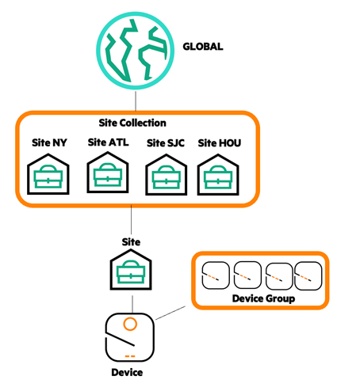
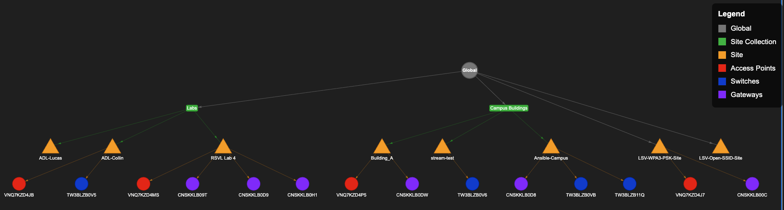
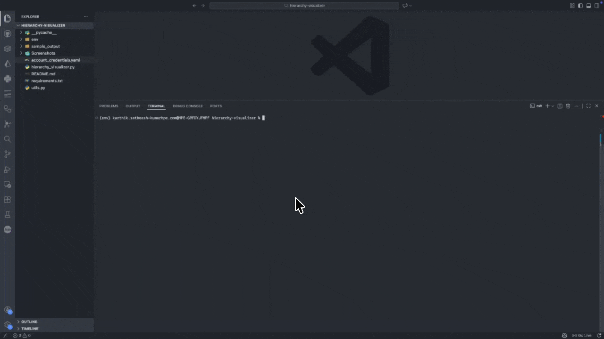

# Hierarchy Visualizer

This workflow reports the Hierarchy in Central, which defines a vertical, parent-child structure used for configuration and scope-based operations. The hierarchy follows the same scope model in Central.

<div align="center">
  
  <div style="text-align: center;">
    Check out the <a href="https://arubanetworking.hpe.com/techdocs/new-central/content/cfg/mul-lvl-hirchy/multi-lvl-heirch.htm">Multi Level Hierarchy Guide</a> to learn more
  </div>
</div>

<br>

Using APIs, the workflow retrieves hierarchy relationships and required configuration attributes (such as `scope_id` and `persona`) and renders them in both tabular and visual formats.

Outputs
- A terminal table for quick inspection
- A CSV file for offline analysis and reporting
- Hierarchy diagrams (static PNG + interactive HTML) for visual inspection of the network structure

An example hierarchy diagram is shown below:



The generated diagram represents only the following scopes within the Central Hierarchy:
- Global
- Site Collections
- Sites
- Devices (associated with Sites)

> [!CAUTION]
> The diagrams do not include **Device Groups** and does not include devices in Central that are not associated with a site.

The diagram is intended as a quick validation tool, useful after deployments or configuration changes, to visually confirm that hierarchy is structured as expected.

## Prerequisites

- Python 3.8 or higher
- API credentials for HPE Aruba Networking Central (JSON or YAML format)
- There should be atleast 1 site created in the account to get new Central configuration attributes

## Installation

1. **Clone the repository and navigate to this workflow folder:**
    ```bash
    git clone -b "v2(pre-release)" https://github.com/aruba/central-python-workflows.git
    cd central-python-workflows/hierarchy-visualizer
    ```

2. **Create and activate a virtual environment, then install dependencies:**
    ```bash
    python3 -m venv env
    source env/bin/activate  # On Windows use: env\Scripts\activate
    pip install -r requirements.txt
    ```
This workflow is tested on the `pycentral` SDK (version: `2.0a13`). Please check compatibility before executing on older/newer versions as there may be changes

3. **Install GraphViz (for diagram generation):**
    
    The script generates diagrams by default, which requires GraphViz:
    
    **macOS (using Homebrew):**
    ```sh
    brew install graphviz
    ```
    
    **Ubuntu/Debian:**
    ```sh
    sudo apt-get install graphviz
    ```
    
    **Windows:**
    Download and install from [graphviz.org](https://graphviz.org/download/)

## Configuration

For API operations in new Central:

```yaml
new_central:
    base_url: <central-api-base-url>
    client_id: <new-central-client-id>
    client_secret: <new-central-client-secret>
```

**Sample Input:** See [`account_credentials.yaml`](./account_credentials.yaml) in this repository for an example credential file.

> [!TIP]
> To obtain your API credentials, please refer to:
> - [Generating and Managing Access Tokens](https://developer.arubanetworks.com/new-central/docs/generating-and-managing-access-tokens)
> - [API Gateway Base URLs](https://developer.arubanetworks.com/new-central/docs/getting-started-with-rest-apis#api-gateway-base-urls) - Use `cluster_name` (e.g. **EU-1**) or `base_url` (e.g. **de1.api.central.arubanetworks.com**)

## Execution

Run the script with the required arguments:

```bash
python hierarchy_visualizer.py -c account_credentials.yaml
```

### Command Line Options

| Name | Type | Description | Required |
|------|------|-------------|----------|
| `-c`, `--credentials` | string | Credentials file for New Central API (JSON or YAML format) | Yes |

## Output

The script generates hierarchy information and saves all outputs to a timestamped directory in the format `results_YYYY-MM-DD_HH-MM-SS/`. This ensures that each run has its own isolated output folder, preventing file overwrites.

### Output Files

For each run, the following files are generated in the timestamped directory:

1. **CSV Report** ([`hierarchy_report.csv`](sample_output/hierarchy_report.csv)): Complete hierarchical data in CSV format. Each row in the output represents a scope component in your Central hierarchy. The table contains the following columns:

    - **Type**: The hierarchical level - Global (top-level), Site Collection, Site, Device, or Device Group
    - **Name**: The display name of the scope element as it appears in Central
    - **Scope-ID**: The ID of the scope element. This is the unique identifier needed to identify the scope element for any new Central APIs.
    - **Serial**: Device serial number (only for Devices)
    - **Device Function (Persona)**: Role of the device along with it's configuration persona in parentheses, which is needed for new Central APIs (only for Devices)
2. **Static Diagram** ([`hierarchy_diagram.png`](sample_output/hierarchy_diagram.png)): GraphViz visualization of the hierarchy
3. **Interactive Diagram** ([`hierarchy_interactive.html`](sample_output/hierarchy_interactive.html)): Pyvis web-based visualization with drag/pan/zoom capabilities

### Example Directory Structure

```
hierarchy-visualizer/
├── results_2026-02-02_10-30-45/
│   ├── hierarchy_report.csv
│   ├── hierarchy_diagram.png
│   └── hierarchy_interactive.html
├── results_2026-02-02_11-15-22/
│   ├── hierarchy_report.csv
│   ├── hierarchy_diagram.png
│   └── hierarchy_interactive.html
└── ...
```

**Workflow Execution Overview**: 

## Troubleshooting

- Ensure your credentials file is valid and in JSON or YAML format.
- Make sure all required dependencies are installed (`pip install -r requirements.txt`).
- If you encounter diagram generation errors, verify GraphViz is properly installed by reviewing the steps in [Installation](#installation).
- If you encounter other issues, please reach out to [Aruba Automation](mailto:aruba-automation@hpe.com)

## Support

- **Automation Team**: [aruba-automation@hpe.com](mailto:aruba-automation@hpe.com)
- **Workflow Issues**: [GitHub Issues](https://github.com/aruba/central-python-workflows/issues)
- **PyCentral Library**: [PyCentral Issues](https://github.com/aruba/pycentral/issues)
