# MSP onboarding workflow

Automate the two most common MSP onboarding workflows using MSP API Credentials:

- **Create tenants**: Create new MSP tenants and provision a Central service in each.
- **Assign devices to tenants**: Assign MSP-owned devices in an existing tenant's Central application and attach the subscription each device needs.

Devices and tenants details can be entered individually or uploaded in bulk via CSVs. It ships in two forms: a **guided web workflow** and a **Python CLI** (`onboarding.py`) for scripted, manifest-driven runs.

> [!NOTE]
> This is a proof of concept for getting started with the MSP onboarding APIs in GreenLake and Central. It is not optimized for large-scale production use. Use it as a reference for your own MSP integrations.

<!-- gif: end-to-end workflow (docs/workflow.gif) -->

## Features

- **Create tenants**: create one or more new MSP tenants and provision a Central service in each, in the region you choose.
- **Assign devices to tenants**: for each MSP-owned device, pick the tenant, the Central application within it, and the subscription to attach, the workflow submits the device assignment and the seat assignment together.
- **CSV upload**: bulk-load tenants to create, or devices with their tenant and subscription mapping, from a CSV file. Rows are validated and errors are reported per row before anything is submitted.
- **Bulk seat assignment**: apply one subscription key to every eligible device of a type, with the key's expiry shown first.
- **Demo mode**: a deterministic catalog for exploring both journeys without credentials.

The flow has three stages: discover tenants and services at the MSP level, exchange into a tenant to provision a service, then assign devices and seats from the MSP workspace. It maps directly onto the pycentral `MSPBase` feature:



**Legend** — 🟩 green: MSP context (MSP credential) · 🟦 blue: tenant context (token exchanged into the tenant).

A copy-pasteable sketch of the same flow:

```python
from pycentral import MSPBase

msp = MSPBase(client_id=..., client_secret=..., workspace_id=MSP_WORKSPACE_ID)

# 1. Discover tenants at the MSP level
tenants = msp.command("GET", "workspaces/v1/msp-tenants", app_name="glp")

# 2. Exchange into one tenant and provision a Central service there
tenant = msp.get_tenant_connection(tenant_workspace_id=TENANT_ID_32_CHARS)
tenant.command(
    "POST", "service-catalog/v1/service-manager-provisions", app_name="glp",
    data={"serviceManagerId": SERVICE_MANAGER_ID, "region": REGION},
)

# 3. Assign devices to that tenant and service (MSP-scoped, batched at five)
msp.command(
    "PATCH", "devices/v1/devices", app_name="glp", params={"id": DEVICE_IDS},
    data={
        "application": {"id": SERVICE_MANAGER_ID},
        "region": REGION,
        "tenantPlatformCustomerId": TENANT_ID_32_CHARS,
    },
)

# 4. Assign a subscription to the same devices
msp.command(
    "PATCH", "devices/v1/devices", app_name="glp", params={"id": DEVICE_IDS},
    data={"subscription": [{"id": SUBSCRIPTION_ID}]},
)
```

## API Calls

All calls go to the GreenLake Platform (GLP) API. Read calls run during discovery and preflight; write calls run only after the operator confirms. Both tracks start by listing tenants with the MSP credential.

### Create tenants

| Step | Service | Method | Endpoint | Description |
|------|---------|--------|----------|-------------|
| 1 | GLP | `GET` | `workspaces/v1/msp-tenants` | Lists managed tenants (exact-name check before creating) |
| 2 | GLP | `GET` | `service-catalog/v1/service-managers` | Lists Central services available to provision |
| 3 | GLP | `GET` | `service-catalog/v1/per-region-service-managers` | Lists regions each service can be provisioned in |
| 4 | GLP | `POST` | `workspaces/v1/msp-tenants` | Creates the tenant |
| 5 | GLP | `POST` | `{base_url}/{workspace_id}/token` | Token exchange (MSP token → tenant-scoped token) |
| 6 | GLP | `POST` | `service-catalog/v1/service-manager-provisions` | Provisions the Central service in the new tenant |

### Assign devices to tenants

| Step | Service | Method | Endpoint | Description |
|------|---------|--------|----------|-------------|
| 1 | GLP | `GET` | `workspaces/v1/msp-tenants` | Lists managed tenants |
| 2 | GLP | `POST` | `{base_url}/{workspace_id}/token` | Token exchange (MSP token → tenant-scoped token) |
| 3 | GLP | `GET` | `service-catalog/v1/service-manager-provisions` | Central applications provisioned in the tenant |
| 4 | GLP | `GET` | `devices/v1/devices` | MSP-owned device inventory (by serial, MAC, or ID) |
| 5 | GLP | `GET` | `subscriptions/v1/subscriptions` | Subscription keys, capacity, and expiry |
| 6 | GLP | `PATCH` | `devices/v1/devices` | Assigns devices to the tenant's Central application (batches of five) |
| 7 | GLP | `PATCH` | `devices/v1/devices` | Assigns the subscription to those devices (batches of five) |
| 8 | GLP | `GET` | `devices/v1/async-operations/{transaction_id}` | Polls each write to completion (up to 2 minutes) |

## Prerequisites

- [uv](https://docs.astral.sh/uv/getting-started/installation/) — the workflow requires Python 3.10+, which uv installs on demand
- An HPE GreenLake **MSP** workspace with an API client credential

## Installation

<!-- 1. Clone the repository and enter the workflow:

   ```bash
   git clone https://github.com/aruba/central-python-workflows.git
   cd central-python-workflows/msp-onboarding
   ``` -->

2. Create the environment and install the dependencies:

   ```bash
   uv venv --python 3.12
   uv pip install -r requirements.txt
   ```

## Configuration

### Credentials

The sign-in screen asks for three values:

- **Client ID** and **Client secret** — a GreenLake API client credential created at the MSP workspace level
- **Workspace ID** — the ID of the **MSP** workspace itself, not a tenant's

> [!TIP]
> The MSP token exchange guide covers [how to create an API credential](https://developer.arubanetworks.com/new-central/docs/msp-token-exchange#how-to-create-an-api-credential) and [finding your MSP workspace ID](https://developer.arubanetworks.com/new-central/docs/msp-token-exchange#finding-your-msp-workspace-id).

The CLI reads the same values from a `token.yaml` in the current directory (same unified GLP format as [`msp-tenant-monitoring/token.yaml.example`](../msp-tenant-monitoring/token.yaml.example)).

### Demo Mode (No Credentials)

Choose **Use demo mode** on the sign-in screen for a deterministic catalog — two tenants, eligible and ineligible services, and subscriptions covering valid, insufficient-capacity, and expired cases. Scenarios select the failure the run exercises:

| Scenario | Exercises |
|----------|-----------|
| `success` | Every write completes |
| `partial-device-write` | One device in a batch fails |
| `ambiguous-write` | An ambiguous response is re-observed inline before retrying |
| `bulk-success` / `bulk-partial` | Multi-tenant runs, all or partially successful |
| `tenant-name-conflict` | A new tenant's name already exists |
| `tenant-creation-systemic` | Tenant creation fails for every tenant |

## Execution

```bash
uv run python server.py
# open http://127.0.0.1:8000/
```

A run walks through:

1. **Sign in** — live credentials, or demo mode
2. **Choose a journey** — onboard new tenants, or add devices to existing tenants
3. **Setup, Devices, Review** — pick tenants and services, map every device to a tenant and subscription key, then review the read-only preflight
4. **Confirm once** — the job starts, and the Review screen switches to live per-device and per-tenant results
5. **Stop safely if needed** — the in-flight batch finishes, the rest is skipped, nothing is rolled back

> [!CAUTION]
> Outside demo mode, a confirmed run performs real writes against real tenants. The read-only preflight and the single confirmation gate exist for that reason — review the preflight before confirming.

Drafts are stored only in the browser and restore an in-progress journey after a refresh; **Discard draft** removes the local draft.

### Command Line Options

| Flag | Description | Default |
|------|-------------|---------|
| `--port` | Port to serve on | `8000` |
| `--host` | Interface to bind | `127.0.0.1` |

The same workflow runs from the terminal via `onboarding.py`, driven by a YAML manifest:

```bash
uv run python onboarding.py --demo list tenants        # also: services, devices, subscriptions
uv run python onboarding.py --demo plan samples/new_tenant.yaml
uv run python onboarding.py --demo run JOB_ID --yes    # also: resume JOB_ID
```

Drop `--demo` for live runs. Sample manifests live in [`samples/`](samples/).

## Output

### On-Screen Output

The web workflow surfaces the plan and the run in one place:

- **Setup stage**: tenant picker with per-tenant service and region discovery; tenants without an eligible service are set aside with the reason shown.
- **Devices stage**: dense inventory table with CSV import, per-device or bulk subscription mapping, and seat capacity and expiry checks.
- **Preflight review**: every tenant, device, and seat assignment with its validation result, plus an impact ledger of what will and will not run.
- **Live run**: the same review switches to per-device status chips (Writing, Complete, Already satisfied, Failed) and per-tenant progress as the job runs.

<!-- screenshot: sign-in screen (docs/sign-in.png) -->
<!-- screenshot: devices stage with seat mapping (docs/devices.png) -->
<!-- screenshot: preflight review (docs/review.png) -->
<!-- screenshot: live run results (docs/run.png) -->

The **CLI** prints the same plan and per-step results as tables, and masks subscription keys in `list subscriptions`.

### Report Files

- `GET /api/jobs/{id}/manifest`: exports the confirmed job as a YAML manifest (including subscription keys) that the CLI can `plan` and `run` again
- CLI `plan` and `run` write no files; runs are session-only and are re-run from the manifest after a server restart

## Troubleshooting

| Problem | Fix |
|---------|-----|
| **Sign-in fails** | Check the client ID, client secret, and that the workspace ID is the MSP workspace's, not a tenant's |
| **Port 8000 already in use** | Start the server with `--port`, e.g. `uv run python server.py --port 8001` |
| **A job disappears after a server restart** | Runs are session-only by design; re-run the manifest, whose pre-write validation absorbs completed work as already satisfied |
| **A step shows "Already satisfied" instead of "Complete"** | The write was re-observed as already in the desired state — usually because a previous run had applied it, or an async operation finished after polling ended |
| **UI returns 503** | The `static/` build is missing from your checkout; restore it from the repository (it is committed) |

## Support

- **Automation Team**: [aruba-automation@hpe.com](mailto:aruba-automation@hpe.com)
- **Workflow Issues**: [GitHub Issues](https://github.com/aruba/central-python-workflows/issues)
- **PyCentral Library**: [PyCentral Issues](https://github.com/aruba/pycentral/issues)
