# MSP Control Tower

Monitor every tenant your MSP manages with a single MSP credential. The tool discovers your managed tenants, then collects sites, devices, clients, and alerts from each one. No per-tenant credentials are needed: pycentral's `MSPBase` exchanges your MSP token for a tenant-scoped token automatically (token exchange). It ships in two forms: a **web dashboard** for interactive exploration and a **Python CLI** (`main.py`) for scripted export.

> [!NOTE]
> This is a proof of concept for getting started with the MSP APIs in Central. It is not optimized for large-scale production use. Use it as a reference for your own MSP integrations.

## Features

- **One MSP credential, all tenants**: discovers every managed tenant and pulls sites, devices, clients, and alerts from each. No per-tenant credentials needed.
- **Animated token-exchange view** that walks through each step of the flow, shown for every tenant interaction.
- **Demo mode**: explore three sample tenants with a simulated token exchange, no credentials required.
- **Dashboard backend** that refreshes the overview every 15 minutes and fetches per-tenant detail on demand.
- **Configurable drilldown**: pick which data types (devices, clients, alerts) to fetch per tenant.
- **Python CLI** (`main.py`) for scripting and export to JSON and CSV.
- **Dark / light / system theme**, persisted across sessions.

The flow has two stages: discover tenants at the MSP level, then exchange into each tenant. It maps directly onto the pycentral `MSPBase` API:



A copy-pasteable sketch of the same flow:

```python
from pycentral import MSPBase
from pycentral.new_monitoring.sites import MonitoringSites
from pycentral.new_monitoring.devices import MonitoringDevices
from pycentral.new_monitoring.clients import Clients

with MSPBase(token_info="token.yaml") as msp:
    # 1 MSP-level call: discover tenants
    resp = msp.command(
        api_method="GET",
        api_path="network-msp/v1/list-tenants",
        api_params={"limit": 100, "next": 1},
        app_name="new_central",
    )
    tenants = resp["msg"]["items"]

    for t in tenants:
        # Tenant token exchange: pycentral handles the GLP lookup for you
        conn = msp.get_tenant_connection(tenant_name=t["tenantName"])

        # 3 tenant-scoped calls: sites, devices, clients
        sites   = MonitoringSites.get_all_sites(conn)
        devices = MonitoringDevices.get_all_device_inventory(conn)
        clients = Clients.get_all_clients(conn)

        print(t["tenantName"], len(sites), len(devices), len(clients))
```

## API Calls

### Overview

Two calls at the MSP level discover tenants and resolve their workspace IDs before any per-tenant work begins.

| Step | Service | Method | Endpoint | Description |
|------|---------|--------|----------|-------------|
| 1 | Central | `GET` | `network-msp/v1/list-tenants` | Discovers all tenants managed by the MSP |
| 2 | GLP | `GET` | `workspaces/v1/msp-tenants` | Resolves tenant name → GLP workspace ID |

### Per-tenant (token exchange + detail)

These calls run on demand — triggered when a user clicks into a tenant card in the dashboard, or when the CLI fetches detail. pycentral exchanges the MSP token for a tenant-scoped connection (step 1), then fetches detail in parallel (steps 2–5).

| Step | Service | Method | Endpoint | Description |
|------|---------|--------|----------|-------------|
| 1 | GLP | `POST` | `{base_url}/{workspace_id}/token` | Token exchange (MSP token → tenant-scoped token) |
| 2 | Central | `GET` | `network-monitoring/v1/sites-health` | Tenant sites |
| 3 | Central | `GET` | `network-monitoring/v1/device-inventory` | Tenant device inventory |
| 4 | Central | `GET` | `network-monitoring/v1/clients` | Tenant connected clients |
| 5 | Central | `GET` | `network-notifications/v1/alerts` | Tenant alerts |

## Prerequisites

- Python ≥ 3.10

## Installation

1. Clone the repository and navigate to the project folder
```bash
git clone -b "v2(pre-release)" https://github.com/aruba/central-python-workflows.git
cd msp-tenant-monitoring
```

2. Create and activate a virtual environment
```bash
python3 -m venv .venv
source .venv/bin/activate  # On Windows use: .venv\Scripts\activate
```

3. Install dependencies
```bash
pip install -r requirements.txt
```

This workflow is tested against `pycentral` `2.0a19`. Please check compatibility before executing on newer versions as there may be changes in the MSP API surface.

## Configuration

> [!TIP]
> **How to obtain the credentials** (client ID, client secret, MSP workspace ID, base URL): see the official Developer Hub guide, [Token Exchange](https://developer.arubanetworks.com/new-central/docs/msp-token-exchange#one-time-setup).

### Credentials Configuration

Copy the example file and fill in your MSP credentials:

```bash
cp token.yaml.example token.yaml
```

`token.yaml` uses the pycentral v2 unified format:

```yaml
unified:
  client_id: <your-glp-client-id>
  client_secret: <your-glp-client-secret>
  workspace_id: <your-msp-workspace-id>     # MSP GLP Workspace ID, not a tenant ID
  base_url: https://internal.api.central.arubanetworks.com
```

> [!NOTE]
> For details on each credential attribute (`client_id`, `client_secret`, `workspace_id`, `base_url`) and how to obtain them, see the **One-Time Setup** section of the [Token Exchange Guide](https://developer.arubanetworks.com/new-central/docs/msp-token-exchange#one-time-setup)

### Region / Base URL

Set `base_url` in `token.yaml` to the API gateway for your Central account. This is determined based on the location of your HPE Aruba Networking Central account. You can use [this guide](https://developer.arubanetworks.com/new-central/docs/getting-started-with-rest-apis#finding-your-base-url) to identify how to find the base URL of your account

### Demo Mode (No Credentials)

Demo mode lets you explore the full dashboard, including the animated token-exchange modal, without any MSP credentials.

1. Start the server: `python3 server.py`
2. Open [http://localhost:8000/](http://localhost:8000/)
3. Click **"Try demo mode"** on the login screen
4. Explore 3 pre-loaded tenants with simulated token exchange

> [!NOTE]
> Demo mode replays pre-built sample data. The exchange modal is fully animated and shows a **"Simulated"** badge, so you can learn the token-exchange flow without a live MSP connection. All tabs (Sites, Devices, Clients, Alerts) are populated from the sample data.

## Execution

1. **Start the dashboard** (UI + API on port 8000):
```bash
python3 server.py
# open http://localhost:8000/
```
Log in with your MSP credentials or click **"Try demo mode"** to explore without credentials. The overview refreshes in the background every 15 minutes; per-tenant detail is fetched on demand when you open a tenant's tabs.

2. **Run the CLI** to print a cross-tenant overview to the terminal:
```bash
python3 main.py
```

3. **Export to JSON and CSV**:
```bash
python3 main.py --export-json --export-csv
```

> For frontend and backend development (HMR, rebuilding static assets, running tests), see [docs/DEVELOPMENT.md](docs/DEVELOPMENT.md).

### Command Line Options

| Flag | Type | Description | Required |
|------|------|-------------|----------|
| `--tenant NAME_OR_ID` | string | Filter output to a single tenant (name substring or ID) | No |
| `--export-json` | flag | Export to `output/msp_export.json` | No |
| `--export-csv` | flag | Export to `output/msp_export.csv` | No |
| `--verbose` | flag | Enable DEBUG logging | No |

## Output

### On-Screen Output

The dashboard surfaces a full cross-tenant view:

- **Overview KPIs**: total device, client, site, and alert counts across all managed tenants
- **Tenant cards** with health bars and per-tenant alert counts. Click any card to drill into tenant detail.
- **Per-tenant drill-down** with four tabs: **Sites**, **Devices**, **Clients**, and **Alerts**. Each tab loads independently on demand.
- **Token exchange modal** that animates four steps (MSP credential → GLP token request → MSP token → tenant token exchange) with live status indicators. Shows a **"Simulated"** badge in demo mode.

### Report Files

From the CLI (`--export-json` / `--export-csv`):

- `output/msp_export.json`: full JSON export of all tenant summaries, sites, devices, clients, and alerts
- `output/msp_export.csv`: CSV summary suitable for spreadsheet review

See `output/sample_output.json` for an example of the JSON schema.

## Troubleshooting

| Problem | Fix |
|---------|-----|
| **"Could not reach the API gateway"** | Check the `base_url` / region. Use the region table in the [Configuration](#region--base-url) section to find your gateway. |
| **"Token request rejected"** | Verify the Client ID and Client Secret in `token.yaml` or the login form match the API client in your GLP portal. |
| **"No tenants returned"** | `workspace_id` is probably a tenant workspace ID. Use the **MSP** GLP workspace ID (found in the GLP portal under your MSP organization). |
| **Python version error on startup** | Python ≥ 3.10 required. Check your version with `python3 --version` and recreate the venv with a newer interpreter. |
| **Dashboard shows no data** | Check `GET /api/status` for `last_refresh_ts`; force a refresh via `POST /api/refresh` and watch `server.py` logs for errors. |

## Support

- **PyCentral MSP feature guide**: [developer.arubanetworks.com: pycentral MSP feature](https://developer.arubanetworks.com/new-central/docs/pycentral-msp-feature#credentials)
- **PyCentral library**: [github.com/aruba/pycentral](https://github.com/aruba/pycentral)
- **Central developer hub API reference**: [developer.arubanetworks.com](https://developer.arubanetworks.com/new-central/docs)
