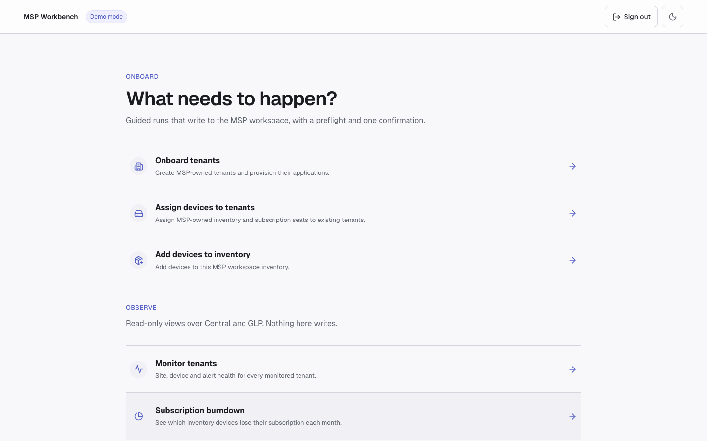
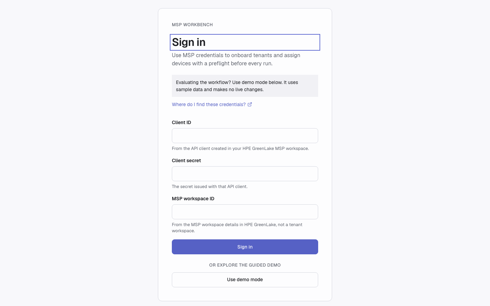
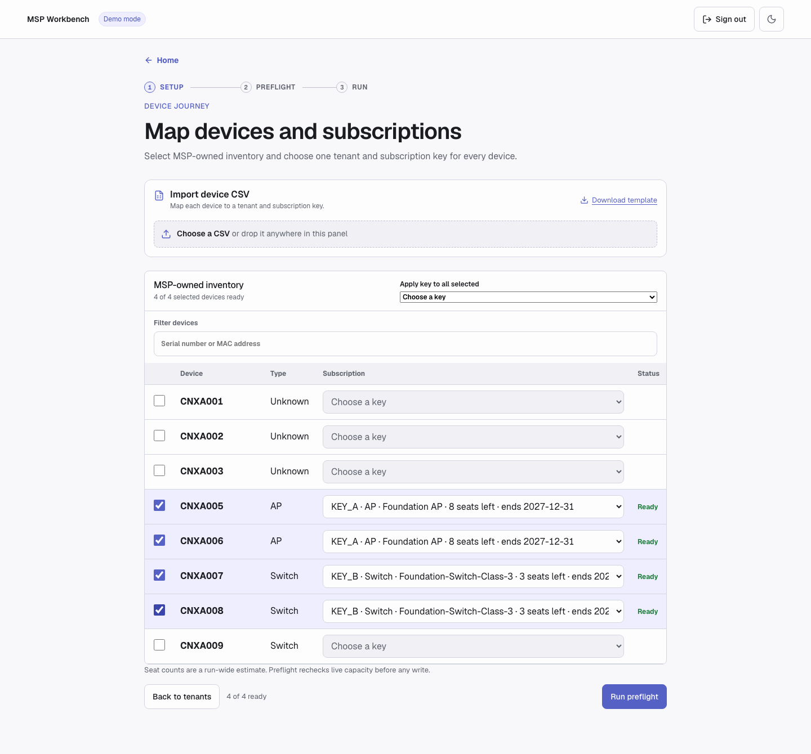
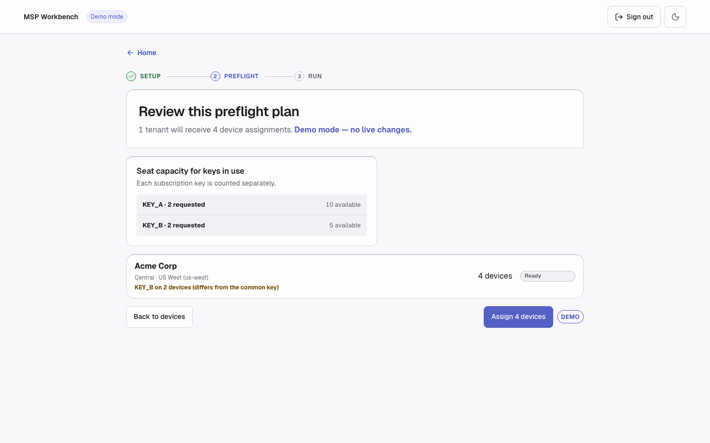
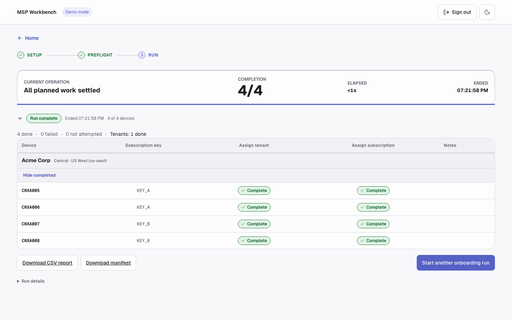
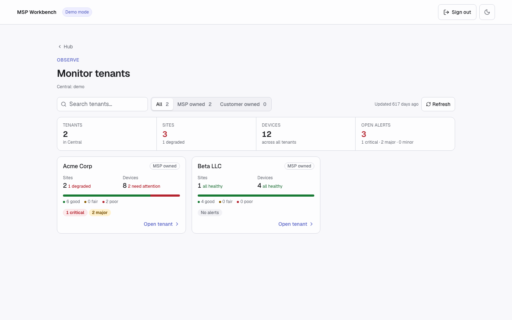
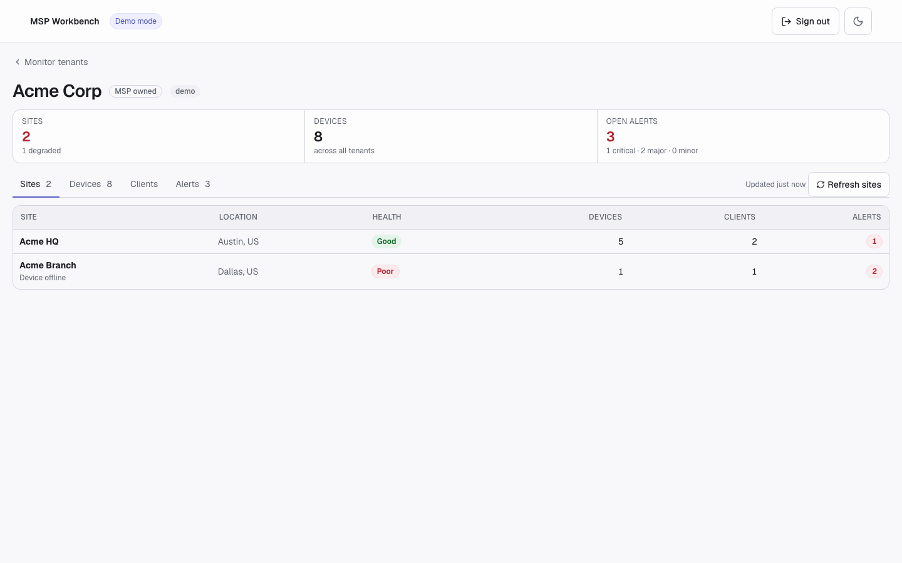
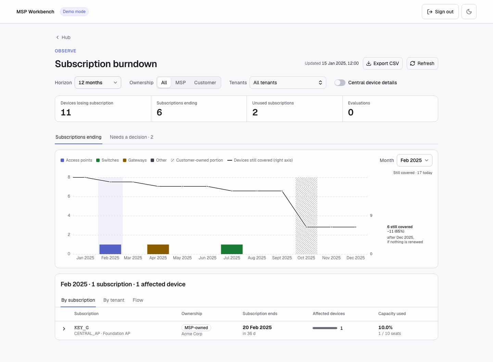

# MSP Workbench

Onboard and observe MSP tenants from one place, using MSP API credentials:

- **Onboard**
  - **Onboard tenants**: create new MSP tenants and provision a Central service in each.
  - **Add devices to inventory**: add new devices (serial number and MAC address) to the MSP workspace inventory.
  - **Assign devices to tenants**: assign MSP-owned devices to an existing tenant's Central application and attach the subscription each device needs.
- **Observe**
  - **Monitor tenants**: tenant health across the MSP, with per-tenant sites, devices, clients, and alerts from Central.
  - **Subscription burndown**: which subscriptions end when, how many devices lose cover, and which subscriptions need a decision.

Tenants and devices can be entered individually or uploaded in bulk via CSVs. It ships in two forms: a **guided web workflow** and a **Python CLI** (`workbench.py`) for scripted, manifest-driven runs.

> [!NOTE]
> This is a proof of concept for getting started with the MSP onboarding APIs in GreenLake and Central. It is not optimized for large-scale production use. Use it as a reference for your own MSP integrations.



## Features

- **Onboard tenants**: create one or more new MSP tenants and provision a Central service in each, in the region you choose. Country and application can be applied to every tenant at once.
- **Add devices to inventory**: add devices to the MSP workspace by serial number and MAC address, in batches of five, with per-device results; devices already in inventory are reported rather than re-added.
- **Assign devices to tenants**: for each MSP-owned device, pick the tenant, the Central application within it, and the subscription to attach; the workflow submits the device assignment and the seat assignment together.
- **CSV upload**: bulk-load tenants to create, devices to add, or devices with their tenant and subscription mapping, from a CSV file. Rows are validated and errors are reported per row before anything is submitted.
- **Apply key to all selected**: select several devices and apply one subscription key to every selected device the key fits.
- **Monitor tenants**: an overview of every tenant with Central health, searchable and filterable by ownership, and a tenant page with Sites, Devices, Clients, and Alerts tabs.
- **Subscription burndown**: subscriptions ending month by month over 12 to 60 months, the devices losing cover, and unused or evaluation subscriptions that need a decision, with optional **Central device details** and CSV export.
- **Central cluster detection**: the MSP's Central cluster is found automatically at sign-in; you never enter a base URL.
- **Demo mode**: a deterministic catalog for exploring every journey and both Observe views without credentials.

One MSP credential drives all five journeys. Most steps run in the MSP context; a token exchange switches into a tenant to provision its Central service or read its Central data. It maps directly onto the pycentral `MSPBase` feature:


**Legend**: 🟩 green = MSP context (MSP credential) · 🟦 blue = tenant context (token exchanged into the tenant) · ⬜ grey dashed box: computed locally, no API call · each step names the API it calls (GLP or Central) · dashed arrow: optional step.

A copy-pasteable sketch of the same flow:

```python
from pycentral import MSPBase

CREDS = {"client_id": ..., "client_secret": ..., "workspace_id": MSP_WORKSPACE_ID}
msp = MSPBase(token_info={"unified": CREDS})

# 1. Discover tenants at the MSP level
tenants = msp.command("GET", "workspaces/v1/msp-tenants", app_name="glp")

# 2. Exchange into one tenant and provision a Central service there
tenant = msp.get_tenant_connection(tenant_workspace_id=TENANT_ID_32_CHARS)
tenant.command(
    "POST", "service-catalog/v1/service-manager-provisions", app_name="glp",
    data={"serviceManagerId": SERVICE_MANAGER_ID, "region": REGION},
)

# 3. Assign devices to that tenant and service (MSP-scoped, batched at five)
msp.command(
    "PATCH", "devices/v1/devices", app_name="glp", params={"id": DEVICE_IDS},
    data={
        "application": {"id": SERVICE_MANAGER_ID},
        "region": REGION,
        "tenantPlatformCustomerId": TENANT_ID_32_CHARS,
    },
)

# 4. Assign a subscription to the same devices
msp.command(
    "PATCH", "devices/v1/devices", app_name="glp", params={"id": DEVICE_IDS},
    data={"subscription": [{"id": SUBSCRIPTION_ID}]},
)

# 5. Central reads use the same credential against the MSP's Central cluster URL
central = MSPBase(token_info={"unified": {**CREDS, "base_url": CENTRAL_BASE_URL}})
health = central.command(
    "GET", "network-msp/v1/list-tenants", app_name="new_central",
    params={"limit": 100, "next": 1},
)

# 6. Exchange into a tenant on that cluster for its Central data
tenant_central = central.get_tenant_connection(tenant_workspace_id=TENANT_ID_32_CHARS)
sites = tenant_central.command("GET", "network-monitoring/v1/sites-health", app_name="new_central")
```

## API Calls

Onboarding calls go to the GreenLake Platform (GLP) API; Observe adds read-only calls to Central (`network-*` endpoints) on the MSP's detected cluster. Read calls run during discovery and preflight; write calls run only after the operator confirms. Token exchanges use `{OAUTH_GLOBAL}/{tenant_id_32}/token`, where `tenant_id_32` is the tenant's dehyphenated workspace ID.

### Sign-in

| Step | Service | Method | Endpoint | Description |
|------|---------|--------|----------|-------------|
| 1 | GLP | `GET` | `workspaces/v1/msp-tenants` | Validates the credential |
| 2 | GLP | `GET` | `service-catalog/v1/service-manager-provisions` | Central applications provisioned in the MSP workspace, and their regions |
| 3 | Central | `GET` | `network-msp/v1/list-tenants` | Probes candidate clusters when a region maps to more than one |

### Onboard tenants

| Step | Service | Method | Endpoint | Description |
|------|---------|--------|----------|-------------|
| 1 | GLP | `GET` | `workspaces/v1/msp-tenants` | Lists managed tenants (exact-name check before creating) |
| 2 | GLP | `GET` | `service-catalog/v1/service-managers` | Lists Central services available to provision |
| 3 | GLP | `GET` | `service-catalog/v1/per-region-service-managers` | Lists regions each service can be provisioned in |
| 4 | GLP | `POST` | `workspaces/v1/msp-tenants` | Creates the tenant |
| 5 | GLP | `POST` | `{OAUTH_GLOBAL}/{tenant_id_32}/token` | Token exchange (MSP token → tenant-scoped token) |
| 6 | GLP | `POST` | `service-catalog/v1/service-manager-provisions` | Provisions the Central service in the new tenant |
| 7 | GLP | `GET` | `service-catalog/v1/service-manager-provisions` | Polls the provision every 30 seconds (up to about 5 minutes) |

### Assign devices to tenants

| Step | Service | Method | Endpoint | Description |
|------|---------|--------|----------|-------------|
| 1 | GLP | `GET` | `workspaces/v1/msp-tenants` | Lists managed tenants |
| 2 | GLP | `POST` | `{OAUTH_GLOBAL}/{tenant_id_32}/token` | Token exchange (MSP token → tenant-scoped token) |
| 3 | GLP | `GET` | `service-catalog/v1/service-manager-provisions` | Central applications provisioned in the tenant |
| 4 | GLP | `GET` | `devices/v1/devices` | MSP-owned device inventory (by serial or ID) |
| 5 | GLP | `GET` | `subscriptions/v1/subscriptions` | Subscription keys, capacity, and expiry |
| 6 | GLP | `PATCH` | `devices/v1/devices` | Assigns devices to the tenant's Central application (batches of five) |
| 7 | GLP | `PATCH` | `devices/v1/devices` | Assigns the subscription to those devices (batches of five) |
| 8 | GLP | `GET` | `devices/v1/async-operations/{transaction_id}` | Polls each write to completion (up to 2 minutes) |

### Add devices to inventory

| Step | Service | Method | Endpoint | Description |
|------|---------|--------|----------|-------------|
| 1 | GLP | `GET` | `devices/v1/devices` | Checks which serials are already in the MSP inventory |
| 2 | GLP | `POST` | `devices/v1/devices` | Adds devices to the MSP inventory (batches of five) |
| 3 | GLP | `GET` | `devices/v1/async-operations/{transaction_id}` | Polls each add to completion (up to 5 minutes) |

### Monitor tenants

| Step | Service | Method | Endpoint | Description |
|------|---------|--------|----------|-------------|
| 1 | GLP | `GET` | `workspaces/v1/msp-tenants` | Lists managed tenants |
| 2 | Central | `GET` | `network-msp/v1/list-tenants` | Tenant health rollup for the overview |
| 3 | GLP | `POST` | `{OAUTH_GLOBAL}/{tenant_id_32}/token` | Token exchange into the opened tenant, on its Central cluster |
| 4 | Central | `GET` | `network-monitoring/v1/sites-health` | Sites tab |
| 5 | Central | `GET` | `network-monitoring/v1/device-inventory` | Devices tab |
| 6 | Central | `GET` | `network-monitoring/v1/clients` | Clients tab |
| 7 | Central | `GET` | `network-notifications/v1/alerts` | Alerts tab |

### Subscription burndown

| Step | Service | Method | Endpoint | Description |
|------|---------|--------|----------|-------------|
| 1 | GLP | `GET` | `workspaces/v1/msp-tenants` | Lists managed tenants |
| 2 | GLP | `GET` | `subscriptions/v1/subscriptions` | Subscriptions, seats, and end dates |
| 3 | GLP | `GET` | `devices/v1/devices` | Devices and the subscriptions they hold |
| 4 | Central | `GET` | `network-msp/v1/device-inventory` | Only when **Central device details** is turned on |

## Prerequisites

- [uv](https://docs.astral.sh/uv/getting-started/installation/) — the workflow requires Python 3.10+, which uv installs on demand
- An HPE GreenLake **MSP** workspace with an API client credential

## Installation

1. Clone the repository and enter the workflow:

   ```bash
   git clone https://github.com/aruba/central-python-workflows.git
   cd central-python-workflows/msp-workbench
   ```

2. Create the environment and install the dependencies:

   ```bash
   uv venv --python 3.12
   uv pip install --prerelease=allow -r requirements.txt
   ```

   `--prerelease=allow` is required: the workflow pins a pre-release of pycentral (`2.0a22`).

## Configuration

### Credentials

The sign-in screen asks for three values:

- **Client ID** and **Client secret** — a GreenLake API client credential created at the MSP workspace level
- **Workspace ID** — the ID of the **MSP** workspace itself, not a tenant's

> [!TIP]
> The MSP token exchange guide covers [how to create an API credential](https://developer.arubanetworks.com/new-central/docs/msp-token-exchange#how-to-create-an-api-credential) and [finding your MSP workspace ID](https://developer.arubanetworks.com/new-central/docs/msp-token-exchange#finding-your-msp-workspace-id).

The CLI reads the same values from a `token.yaml` in the current directory (same unified GLP format as [`token.yaml.example`](token.yaml.example)).



### Demo Mode (No Credentials)

Choose **Use demo mode** on the sign-in screen, or pass `--demo` to the CLI, for a deterministic catalog — two MSP-owned tenants plus read-only customer-owned Gamma Hospitality, eligible and ineligible services, subscriptions covering valid, insufficient-capacity, and expired cases, and Central sites and devices for Monitor. Demo mode runs the `success` scenario. To exercise a failure, sign in with `POST /api/auth/demo?scenario=<name>` instead:

| Scenario | Exercises |
|----------|-----------|
| `success` | Every write completes |
| `partial-device-write` | One device in an assignment or inventory-add batch fails |
| `ambiguous-write` | An ambiguous response is re-observed inline before retrying |

## Execution

```bash
uv run python server.py
# open http://127.0.0.1:8000/
```

| Flag | Description | Default |
|------|-------------|---------|
| `--port` | Port to serve on | `8000` |
| `--host` | Interface to bind | `127.0.0.1` |

### Onboard

An onboarding run walks through:

1. **Sign in** — live credentials, or demo mode
2. **Choose a journey** — Onboard tenants, Assign devices to tenants, or Add devices to inventory
3. **Setup, Devices, Review** — pick tenants and services, map every device to a tenant and subscription key, then review the read-only preflight
4. **Confirm once** — the job starts, and the Review screen switches to live per-device and per-tenant results
5. **Stop safely if needed** — the in-flight batch finishes, the rest is skipped, nothing is rolled back

> [!CAUTION]
> Outside demo mode, a confirmed run performs real writes against real tenants. The read-only preflight and the single confirmation gate exist for that reason — review the preflight before confirming.







A refresh during a run reconnects to the running job. A job lives only as long as the server process.

### Observe

Both Observe views are read-only.

- **Monitor tenants** lists every tenant with Central health. The line under the title shows the detected Central cluster; if detection fails, the reason is shown with **Retry**. Search by name or filter by ownership, then open a tenant for its **Sites**, **Devices**, **Clients**, and **Alerts**. Opening a tenant exchanges into it; the exchange dialog shows each step and offers **Retry** if it fails.
- **Subscription burndown** shows subscriptions ending per month. **Subscriptions ending** breaks each month down **By subscription**, **By tenant**, or as a **Flow**; **Needs a decision** lists unused and evaluation subscriptions.
- **Central device details** is off by default. Turning it on reads Central's device inventory and marks each device losing cover as Online, Offline, No status, or Not found in Central.
- While data loads, figures carry a **Partial** badge and update as pages arrive; **Export CSV** unlocks once the read is complete.
- Data is read once per session. **Refresh** re-reads it and keeps the previous data on screen until the new read finishes.







### Command Line

The same workflow runs from the terminal via `workbench.py`, driven by a YAML manifest:

```bash
uv run python workbench.py --demo list tenants        # also: services, devices, subscriptions
uv run python workbench.py --demo --fields workspace_name --limit 10 list tenants
uv run python workbench.py --demo monitor overview
uv run python workbench.py --demo monitor tenant "Acme Corp" --sites --alerts
uv run python workbench.py --demo monitor export --format csv --out tenants.csv
uv run python workbench.py --demo subscriptions burndown --scope msp --months 12
uv run python workbench.py --demo subscriptions burndown --scope tenant --tenant "Gamma Hospitality" --format csv --out gamma.csv
uv run python workbench.py --demo plan samples/new_tenant.yaml
uv run python workbench.py --demo run samples/new_tenant.yaml --yes
```

Drop `--demo` for live runs. Sample manifests and CSVs live in [`samples/`](samples/). Agents should follow the [`workbench-cli` skill](skills/workbench-cli/SKILL.md).

| Flag | Applies to | Values |
|------|------------|--------|
| `--format` | all commands | `json` (default) or `table` |
| `--fields`, `--limit`, `--out` | all commands | columns to keep, rows to keep, file to write |
| `--verbose` | all commands | print pycentral logs |
| `--sites`, `--monitored-devices`, `--clients`, `--alerts` | `monitor tenant` | sections to include |
| `--format`, `--out` | `monitor export` | `csv` or `json`, and the output file |
| `--scope` | `subscriptions burndown` | `msp` (MSP-owned), `tenant` (one customer-owned tenant), `tenants` (customer-owned), `all` |
| `--tenant` | `subscriptions burndown` | tenant name or ID; repeatable |
| `--months` | `subscriptions burndown` | `12`, `24`, `36`, `48`, `60` |
| `--view` | `subscriptions burndown` | `losing_cover` (default), `unused`, `evaluations` |
| `--lifecycle` | `subscriptions burndown` | `current`, `expired`, `all`; `unused` and `evaluations` views only |
| `--month` | `subscriptions burndown` | `YYYY-MM`; `losing_cover` view only |
| `--search` | `subscriptions burndown` | text filter; `unused` and `evaluations` views only |
| `--format`, `--out` | `subscriptions burndown` | `json` or `csv`, and the output file |

Central device details is web-only; the CLI has no equivalent.

### Podman container

Runs the committed `static/` UI and the backend in one non-root process, for a
single local operator. The image contains the web workflow only; run the CLI
from a local checkout.

On macOS, install Podman with [Homebrew](https://brew.sh) and start its VM once:

```bash
brew install podman
podman machine init    # first time only
podman machine start
```

Then build and run:

```bash
cd msp-workbench
podman build -t msp-workbench:local -f Containerfile .
podman run --rm --name msp-workbench -p 127.0.0.1:8000:8000 msp-workbench:local
```

Open `http://127.0.0.1:8000/` (change the first port to use another host port).
Sign in through the browser; don't mount `token.yaml` into the container.

State is in memory. Settle or **Stop** any running job before `podman stop
msp-workbench`; stopping the container mid-job loses the session and does not
undo writes already made.

## Output

### On-Screen Output

The web workflow surfaces the plan and the run in one place:

- **Setup stage**: tenant picker with per-tenant service and region discovery; tenants without an eligible service are set aside with the reason shown.
- **Devices stage**: dense inventory table with CSV import, per-device or apply-to-selected subscription mapping, and seat capacity and expiry checks.
- **Preflight review**: every tenant, device, and seat assignment with its validation result, plus an impact ledger of what will and will not run.
- **Inventory add**: editable serial and MAC grid with CSV import, row-level validation, preflight, then per-device results.
- **Live run**: the same review switches to per-device status chips (Writing, Complete, Already satisfied, Failed) and per-tenant progress as the job runs.
- **Monitor** and **Burndown**: see [Observe](#observe).

The **CLI** emits compact JSON envelopes by default or aligned tables on request.
Subscription keys are shown on both CLI and web surfaces; subscription IDs remain internal.

### Report Files

- **Report CSV** (`GET /api/jobs/{id}/report.csv`): per-device results of a job, linked from the run screen
- **Failed devices CSV** (`GET /api/jobs/{id}/failed-devices.csv`): only the devices that failed, ready to fix and re-import; **Run these devices again** starts a new run with them directly
- **Manifest** (`GET /api/jobs/{id}/manifest`): the confirmed job as a YAML manifest (including subscription keys) that the CLI can `plan` and `run` again
- **Burndown CSV**: **Export CSV** on the Burndown screen, or `subscriptions burndown --format csv --out FILE`
- **Monitor export**: `monitor export --format csv|json --out FILE`
- CLI `plan` and `run` write no files unless `--out PATH` is supplied; runs are session-only and are re-run from the manifest after a server restart

## Troubleshooting

To report a problem, launch with `MSP_API_DIAGNOSTICS=1` and attach the stderr
lines prefixed `MSP_API_DIAGNOSTICS `. They record each API call's operation,
timing, and status, and contain no secrets or payloads.

| Problem | Fix |
|---------|-----|
| **Sign-in fails** | Check the client ID, client secret, and that the workspace ID is the MSP workspace's, not a tenant's |
| **"Couldn't find your Central cluster"** | GreenLake shows no provisioned Central application for the MSP workspace, or its cluster didn't answer; confirm Central is provisioned, then **Retry** |
| **Port 8000 already in use** | Start the server with `--port`, e.g. `uv run python server.py --port 8001` |
| **A job disappears after a server restart** | Runs are session-only by design; re-run the manifest, whose pre-write validation absorbs completed work as already satisfied |
| **A step shows "Already satisfied" instead of "Complete"** | The write was re-observed as already in the desired state — usually because a previous run had applied it, or an async operation finished after polling ended |
| **UI returns 503** | The `static/` build is missing from your checkout; restore it with `git checkout -- static` |

## Support

- **Automation Team**: [aruba-automation@hpe.com](mailto:aruba-automation@hpe.com)
- **Workflow Issues**: [GitHub Issues](https://github.com/aruba/central-python-workflows/issues)
- **PyCentral Library**: [PyCentral Issues](https://github.com/aruba/pycentral/issues)
