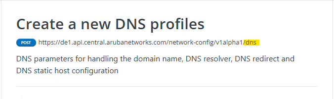
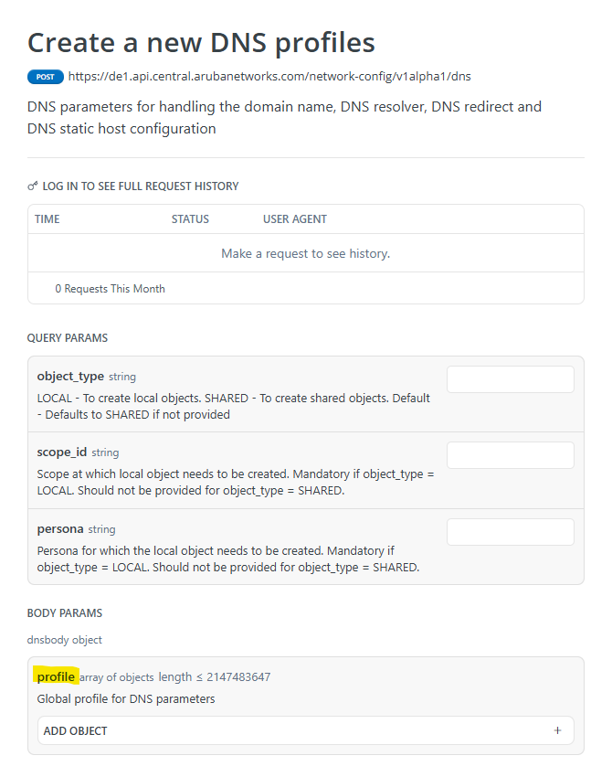
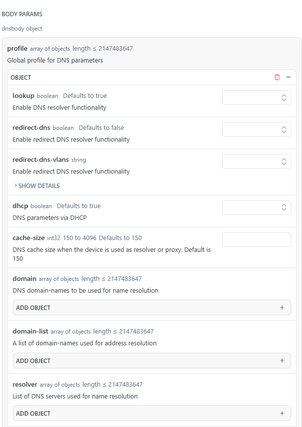

# Profile Operations Workflow

This workflow demonstrates how to use the Pycentral library to manage Central 
library profiles. It covers creating, reading, updating, and deleting configuration 
profiles through Central API handled by Pycentral. The workflow focuses on 
performing example operations for both individual and bulk library profiles.

## Overview
Showcases how to connect to Central and demonstrate the two main approaches to 
profile operations with Pycentral:
1. **Connecting to Central with the Pycentral base object**
2. **Individual Profile Operations**
3. **Bulk Profile Operations**

## Prerequisites
### Installation Steps
1. Install a virtual environment (refer to [Python venv documentation](https://docs.python.org/3/library/venv.html)). 
   Make sure Python version 3 is installed on your system.
    ```bash
    python -m venv env
    ```

2. Activate the virtual environment:
    - On Mac/Linux:
      ```bash
      source env/bin/activate
      ```
    - On Windows:
      ```bash
      env\Scripts\activate.bat
      ```

3. Clone the repository and cd into the profile-operations directory.
    ```bash
    git clone https://github.com/aruba/central-python-workflows.git
    cd central-python-workflows/profile-operations
    ```

4. Install the required packages:
    ```bash
    python -m pip install -r requirements.txt
    ```

### Central API Credentials
Generating a central connection with pycentral requires passing a dictionary
containing Central token credential information to the NewCentralBase class as an 
argument. Information you need:
- **base_url**: Central instance URL
- **client_id**: Central client ID
- **client_secret**: Central client secret

The dictionary structure:
```python
{
    "new_central": {
        "base_url": "",
        "client_id": "",
        "client_secret": "",
    }
}
```
For best practice credentials should be loaded from a seperate file. Reference 
[central_token.json](central_token.json) for an example.
Learn more about obtaining credentials with the following links:
- [Base URLs of Central Clusters](https://developer.arubanetworks.com/new-hpe-anw-central/docs/getting-started-with-rest-apis#base-urls)  
- [Generating Access Token from Central UI](https://developer.arubanetworks.com/new-hpe-anw-central/docs/generating-and-managing-access-tokens#using-hpe-greenlake-ui)  
- [Generating Access Token using OAuth APIs](https://developer.arubanetworks.com/new-hpe-anw-central/docs/generating-and-managing-access-tokens#using-hpe-greenlake-api) 

## Configuration Requirements
To work with configuration profiles with Pycentral we need to gather
several pieces of information required for interacting with the Central API. This
includes the API endpoint, the bulk key, and the profile configurations we want to 
use. We can gather this information by referring to the official configuration API 
reference on the [Developer Hub](https://developer.arubanetworks.com/new-central-config/reference)

### Gathering API information from the Configuration Reference
We will use the API reference for [dns](https://developer.arubanetworks.com/new-central-config/reference/createdns) 
as an example to demonstrate how to gather the information required for working with 
profiles.

1. Locate the API endpoint  
The API endpoint will be the last suffix appended to the full URL on the reference 
page  


2. Determine the bulk key  
We refer to the bulk key in Pycentral as the key for the body object of the payload.
Most often, the bulk key will simply be 'profile', however some APIs will use a 
unique identifier. In the example image for DNS we can see that the bulk key is 
'profile'.


3. Profile configurations  
You can use the body object in API reference to find valid configuration values to 
use in your own configuration object for Pycentral. Here are some of the values for 
the DNS profile body object for example:  


Here is a simplified example profile configuration dictionary in python that we use 
to create a DNS library profile with Pycentral:  
```python
dns_profile = {
    "name": "example-dns",
    "description": "example-dns description",
    "resolver": [
        {"vrf": "default", "name-server": [{"ip": "8.8.8.8", "priority": 1}]}
    ],
}
```
An easy way to get example configurations for a profile you are unfamiliar with is 
to create a profile using the web UI in Central and then run a GET request for the 
profile with Pycentral.

## Executing the script
The script can be run as is with valid credentials to see how Pycentral runs 
operations in the terminal.

With the API credentials filled out in the profiles_operations.py file, and in the 
profile-operations directory:
```bash
python profiles_operations.py
```

### Script Operations
#### Individual Operations (DNS Profile)
1. **Create** a DNS profile
2. **Read** the created profile
3. **Update** the profile description
4. **Delete** the profile

#### Bulk Operations (VLAN Profiles)
1. **Create** multiple VLAN profiles at once
2. **Read** all VLAN profiles from Central library
3. **Update** the description of all VLANS simultaneously
4. **Delete** all profiles

## Documentation

- [Central Configuration API Reference](https://developer.arubanetworks.com/new-central-config/reference/)
- [Getting Started with Pycentral](https://developer.arubanetworks.com/new-central/docs/getting-started-with-python)
- [Getting Started with Central APIs](https://developer.arubanetworks.com/new-central/docs/getting-started-with-rest-apis)