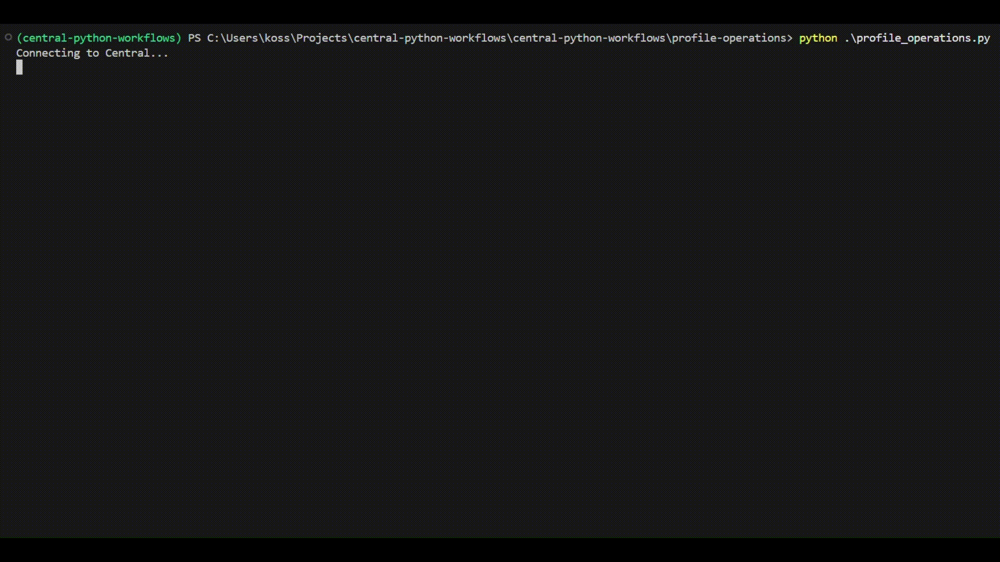

# Profile Operations

This workflow demonstrates how to use the PyCentral library to manage Central 
library profiles. It covers creating, reading, updating, and deleting configuration 
profiles through Central API handled by PyCentral. The workflow focuses on 
performing example operations for both individual and bulk library profiles.

## Prerequisites

- Python 3.8 or higher
- API credentials for HPE Aruba Networking Central & GLP (JSON or YAML format)

## Installation

1. Clone the repository and navigate to this workflow folder
```bash
git clone -b "v2(pre-release)" https://github.com/aruba/central-python-workflows.git
cd central-python-workflows/profile-operations
```

2) Create and activate a virtual environment, then install dependencies
- On macOS/Linux: source venv/bin/activate
- On Windows (PowerShell): venv\Scripts\Activate.ps1

```bash
python3 -m venv venv
source venv/bin/activate  # On Windows use: venv\Scripts\activate
pip install -r requirements.txt
```

_This workflow is tested on the `pycentral` SDK (version: `2.0a7`). Please check compatibility before executing on older/newer versions as there may be changes_

## Configuration

### Credentials Configuration (central_token.json)

For API operations in new HPE Aruba Networking Central:

```json
{
    "new_central": {
        "base_url": "",
        "client_id": "",
        "client_secret": "",
    }
}
```

**Sample Input:** See [`central_token.json`](./central_token.json) in this repository for an example credential file.

> [!TIP]
> **Where to find these:**
> - [Central API Gateway Base URLs](https://developer.arubanetworks.com/new-hpe-anw-central/docs/getting-started-with-rest-apis#api-gateway-base-urls) 
> - [How to get API Credentials for new Central](https://developer.arubanetworks.com/new-hpe-anw-central/docs/generating-and-managing-access-tokens) 

### Workflow Input Data

This workflow is preset with sample API data for script execution. The following
instructions detail how to gather the information required to create your own 
configuration profiles with the PyCentral profile module.

1. Locate the API endpoint:
The API endpoint will be the last suffix appended to the full URL on the reference 
page.  


2. Determine the bulk key: 
We refer to the bulk key in PyCentral as the key for the body object of the payload.
Most often, the bulk key will simply be 'profile', however some APIs will use a 
unique identifier. In the example image for DNS we can see that the bulk key is 
'profile'.  


3. Profile configurations:  
You can refer to the body object in the API reference to find valid configuration
key/values to use for your own object with PyCentral. Here are some of the values for
the DNS profile body object as an example.  


Example profile configuration dictionary in python that we use 
to create a DNS library profile with PyCentral:  
```python
dns_profile = {
    "name": "example-dns",
    "description": "example-dns description",
    "resolver": [
        {"vrf": "default", "name-server": [{"ip": "8.8.8.8", "priority": 1}]}
    ],
}
```
An easy way to get example configurations for a profile you are unfamiliar with is 
to create a profile using the web UI in Central, and then run a GET request for the 
profile with PyCentral.

## Execution

This workflow is executed by the profile_operations.py script and demonstrates the use
of the following PyCentral modules and Central APIs:

1. Connecting to Central with the PyCentral base object
2. Individual profile module operations
    - Create DNS - [Create a new DNS profile](https://developer.arubanetworks.com/new-central-config/reference/creatednsprofilebyid)
    - Get DNS - [Read existing DNS profile](https://developer.arubanetworks.com/new-central-config/reference/readdnsprofilebyid)
    - Update DNS - [Modify DNS profile](https://developer.arubanetworks.com/new-central-config/reference/updatednsprofilebyid)
    - Delete DNS - [Delete existing DNS profile](https://developer.arubanetworks.com/new-central-config/reference/deletednsprofilebyid)
3. **Bulk Profile Operations**
    - Create VLAN - [Create L2-VLAN](https://developer.arubanetworks.com/new-central-config/reference/createlayer2vlanl2vlanbyid)
    - Get all VLAN Profiles - [Read L2-VLAN IDs](https://developer.arubanetworks.com/new-central-config/reference/readlayer2vlan)
    - Update VLAN - [Update L2-VLAN](https://developer.arubanetworks.com/new-central-config/reference/updatelayer2vlanl2vlanbyid)
    - Delete VLAN - [Delete L2-VLAN](https://developer.arubanetworks.com/new-central-config/reference/deletelayer2vlanl2vlanbyid)

The workflow is executed by running the following command:

```bash
python profile_operations.py
```

## Output

Output will be displayed in the terminal showing results of the profile module 
operations covered in the script:

Script Operations:
- Individual Operations (DNS Profile):
    1. **Create** a DNS profile
    2. **Read** the created profile
    3. **Update** the profile description
    4. **Delete** the profile
- Bulk Operations (VLAN Profiles):
    1. **Create** multiple VLAN profiles at once
    2. **Read** all VLAN profiles from Central library
    3. **Update** the description of all VLANS simultaneously
    4. **Delete** all profiles

If the script runs successfully, the terminal will show output similar to the following:



## Troubleshooting

- Authentication / tokens: Ensure your token file is complete and has valid credentials for Central.
- SDK compatibility: If method calls fail unexpectedly, confirm the installed PyCentral version matches tested versions (v2.0a7) or update helpers accordingly.

## Support

- **Automation Team**: [aruba-automation@hpe.com](mailto:aruba-automation@hpe.com)
- **Workflow Issues**: [GitHub Issues](https://github.com/aruba/central-python-workflows/issues)
- **PyCentral Library**: [PyCentral Issues](https://github.com/aruba/pycentral/issues)
- **Developer Hub guide**: [Profile Operations Developer Hub Guide](https://developer.arubanetworks.com/new-central/docs/profile-operations)
- **Configuration reference**: [Central Configuration API Reference](https://developer.arubanetworks.com/new-central-config/reference/)
- **PyCentral quickstart guide**: [Getting Started with Pycentral](https://developer.arubanetworks.com/new-central/docs/pycentral-quickstart-guide)
- **Central API guide**: [Getting Started with Central APIs](https://developer.arubanetworks.com/new-central/docs/getting-started-with-rest-apis)
