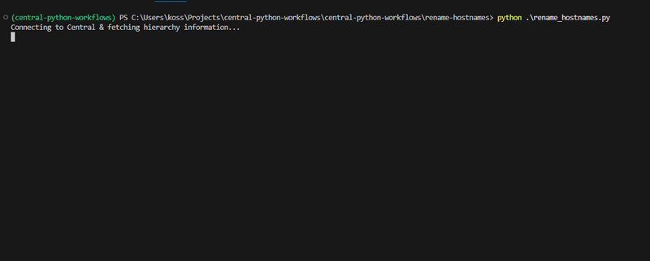

# Rename Hostnames
This workflow uses the PyCentral SDK to automate configuring the hostname of devices in
Central. The workflow first checks the device serial numbers against Central to verify
devices are ready to be configured. Then, device hostnames are either created or 
updated determined by their current System Information profile status. Only the default 
System Information profile will be updated. In the case where there are no current
profiles, one will be created with the default profile name of "sys-system-info-profile"
The workflow will also create a CSV output file containing the status of hostname
configuration operations.

## Prerequisites
- Python 3.8 or higher
- API credentials for HPE Aruba Networking Central(YAML format)
- All target devices are provisioned and configuration ready

## Installation

1. Clone the repository and navigate to this workflow folder
```bash
git clone -b "v2(pre-release)" https://github.com/aruba/central-python-workflows.git
cd central-python-workflows/rename-hostnames
```

2) Create and activate a virtual environment, then install dependencies
- On macOS/Linux: source venv/bin/activate
- On Windows (PowerShell): venv\Scripts\Activate.ps1

```bash
python3 -m venv venv
source venv/bin/activate  # On Windows use: venv\Scripts\activate
pip install -r requirements.txt
```

_This workflow is tested on the PyCentral SDK (version: 2.0a21). Please check compatibility before executing on older/newer versions as there may be changes_

## Configuration

### Credentials Configuration (account_credentials.yaml)

For API operations in new HPE Aruba Networking Central:

```yaml
new_central:
    cluster_name: <cluster-name>  # or base_url: <central-api-base-url>
    client_id: <central-client-id>
    client_secret: <central-client-secret>
```
**Sample Input:** See [`account_credentials.yaml`](./account_credentials.yaml) in this repository for an example credential file.


> [!TIP]
> **Where to find these:**
> - [Central API Gateway Base URLs](https://developer.arubanetworks.com/new-hpe-anw-central/docs/getting-started-with-rest-apis#api-gateway-base-urls) 
> - [How to get API Credentials for Central](https://developer.arubanetworks.com/new-hpe-anw-central/docs/generating-and-managing-access-tokens)

### Workflow Input Data

This workflow requires an input CSV file containing the serial number of the devices to 
have their hostname changed, in addition to the new hostname. By default the workflow
will use the `variables_sample.csv` file if none is provided.

Update the [variables_sample.csv](./variables_sample.csv) with device serial numbers and 
new hostnames, or create a custom CSV with the same format to be used as an argument
when executing the script.

```csv
serial,new_hostname
{device1_serial},{device1_new_hostname}
{device2_serial},{device2_new_hostname}
```

> [!NOTE]
> **Sample Input:** See [`variables_sample.csv`](./variables_sample.csv) in this repository for an example input file structure.

## Execution

```bash
python rename_hostnames.py
```
With arguments:

```bash
python rename_hostnames.py -c <credentials_file> --hostnames_csv <input_file>
```

### Command Line Options

| Name             | Type   | Description                          | Required | Default                  |
|------------------|--------|--------------------------------------|----------|--------------------------|
| credential_file | string | Path to file with Central credentials | No       | account_credentials.yaml |
| hostnames_csv    | string | Path to input CSV file               | No       | variables_sample.csv     |

## Output

If the script runs successfully, the terminal will show output similar to the following:



A CSV file with the results of the script execution will be saved as `output.csv`. The
results include the serial number of the devices, their new hostnames, and the outcome
of the operation.

Example `output.csv` file:

```csv
serial_number,new_name,status
serial1,hostname1,success
seria2,hostname2,failure
```

## Accompanying Utility Script: Delete System Info Profiles

### Overview

The `delete_system_info.py` script is a utility for fixing devices stuck in a bugged 
state due to Central no longer supporting multiple local system-info profiles. Devices
follow the same provisioning requirements as laid out previosuly for renaming hostnames.

**Background:** Devices can no longer have multiple local system-info profiles in 
Central. Any device with multiple system-info profiles will be unable to create or 
update these profiles until all extra profiles are removed (leaving zero or one 
profile). This script cleans up the bugged state by deleting all local system-info 
profiles for the target devices.

### When to Use

Use this utility when:
- A device fails to update its hostname with errors related to maximum/existing 
  system-info profiles. Example error:
    ```json
    {
        "httpStatusCode": 400,
        "message": "module aruba-system-info can only have single instance per scope",
        "debugId": "axxxxxxxxxxxxxxxxxxxxxxxxxxxxxxx",
        "errorCode": "HPE_GL_ERROR_BAD_REQUEST"
    }
    ```
- A device has multiple system-info profiles from legacy configurations
- You need to reset a device's system-info profile state before re-configuring

### Input

Create a CSV file with a `serial` column header containing target device serial numbers:

```csv
serial
CNXXXXXXXX
CNXXXXXXX1
```

By default, the script uses `delete_serials.csv`. Update this file or provide a custom CSV.

### Execution

```bash
python delete_system_info.py
```

With arguments:

```bash
python delete_system_info.py -c <credentials_file> --serials_csv <input_file>
```

Or provide serial numbers directly:

```bash
python delete_system_info.py --serials CNXXXXXXXX,CNXXXXXXX1,CNXXXXXXX2
```

### Command Line Options

| Name            | Type   | Description                           | Required | Default                  |
|-----------------|--------|---------------------------------------|----------|--------------------------|
| credential_file | string | Path to file with Central credentials | No       | account_credentials.yaml |
| serials_csv     | string | Path to CSV file with serial numbers  | No       | delete_serials.csv       |
| serials         | string | Comma-separated list of serials       | No       | None                     |

### Output

Results are saved to `delete_system_info_results.csv`:

```csv
serial_number,device_function,profiles_deleted,status
CNXXXXXXXX,ACCESS_SWITCH,2,success
CNXXXXXXX1,AP,0,no_profiles
```

## Troubleshooting

- Authentication / tokens: Ensure your credentials file is complete and has valid credentials for Central.
- Ensure all target devices have been assigned a device function and are ready for provisioning
- Ensure hostnames are a valid format for the device type they are attempting to be assigned to
- SDK compatibility: If API calls fail unexpectedly, confirm the installed pycentral version matches tested versions (v2.0a16) or update helpers accordingly.
- If unable to update/create hostnames review Delete System Info utility script

## Support

- **Automation Team**: [aruba-automation@hpe.com](mailto:aruba-automation@hpe.com)
- **Workflow Issues**: [GitHub Issues](https://github.com/aruba/central-python-workflows/issues)
- **PyCentral Library**: [PyCentral Issues](https://github.com/aruba/pycentral/issues)
