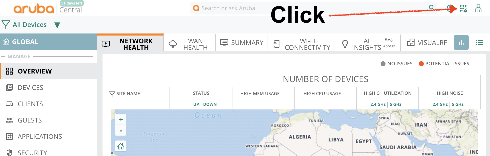
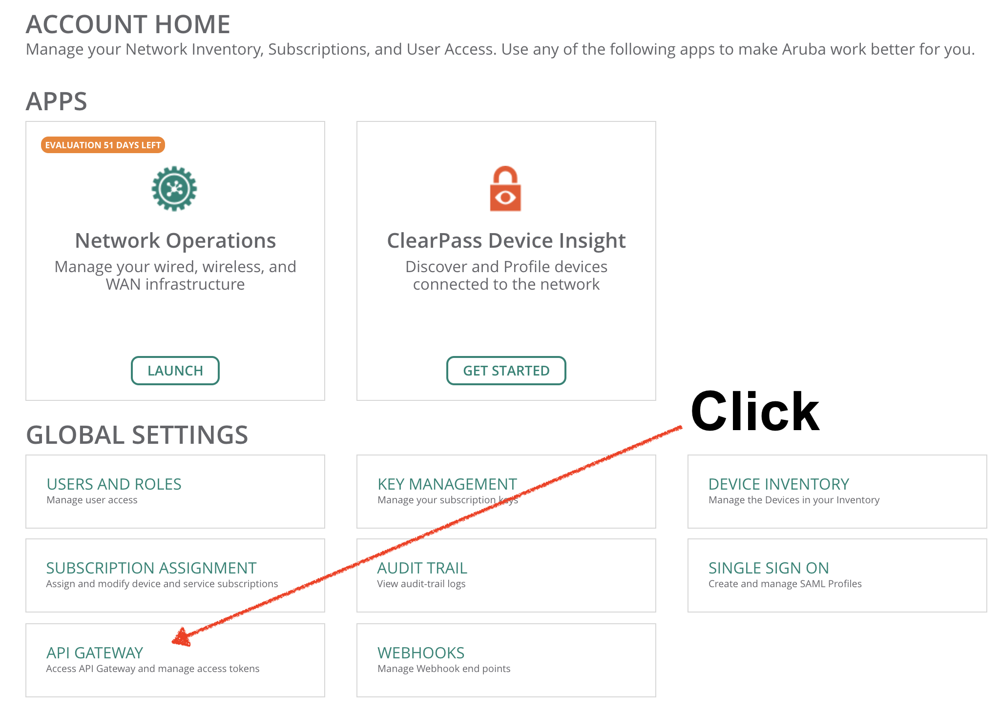
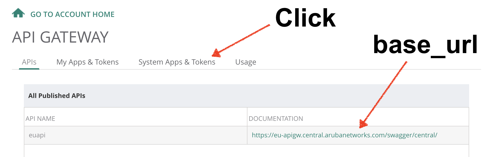
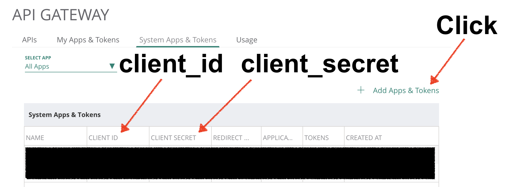
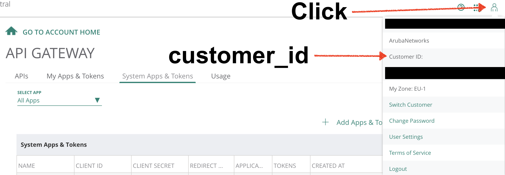

# Central API Getting Started

Aruba Central is a cloud-based network management and configuration platform.
Aruba Central offers a REST API, allowing programmatic interaction with the platform for the collection of data and configuration of assets.
The API is secured using OAuth 2.0, which provides authorization based on tokens issued to applications.

A key aspect of creating an automated workflow to interact with Central's API is the acquistion, management and refresh of OAuth tokens.

## Aruba Central API Workflow Project Summary

The objectives of this project are as follows:

1. Provide an introduction and general overview of OAuth 2.0 and Aruba Central's implementation of this framework.
2. Present multiple workflows that interact and manage tokens in a programmatic fashion.
3. Educate the user in the various workflows, allowing them to use them in their own projects.

## Security Considerations

This document is aimed at beginners to both the Aruba Central API and Python. 
To fulfil the project's aim of explaining the operations involved in accessing the API, the examples given do not adhere to strict security concerns. 
Certain examples of code are considered unsafe and a security threat. There are warnings within the code when this is the case. These unsafe examples are for educational purposes only and should not be used outside of the context of a learning exercise.  

Please note that for the purposes of this project the term **required variables** will be used to denote those pieces of information that are required to interact with the Aruba Central API.  
The required variables are:

      1. username
      2. password
      3. customer ID
      4. client ID
      5. client secret
      6. access token
      7. refresh token
   
* The required variables to interact with the Aruba Central API must be treated with the same care as the user's password.  
* The required variables must not be shared or copied to public sites, blogs etc.  
* Do not include the required variables in your scripts. The examples in this project that do so are for educational purposes only and are unsafe.  
* Take care not to check in to version control documents that contain your required variables.

In addition the user should follow the following guidelines to ensure they are not placing the security of their access to the Aruba Central API platform at risk:

* If using git, use the .gitignore file to ignore the locally stored required variables file.
* Also, alway use `git add <my-file-name>` to stage only the required files for check in to a git server.
* Do not use `git add *` or other forms of wildcard that risk unwittingly staging sensitive files.

## Central REST API OAuth 2.0 Tokens

The Central REST API utilises an OAuth 2.0 authorization framework. Authorization is requested and granted in accordance with the defined steps and, if successful, two tokens will be issued by the Authorization Server:

* Access token - this is end result of a successful authentication and authorization process. The access token is combined with subsequent API calls, allowing users access to configure, manage and receive data from the API. However, the access token is time-limited.
* Refresh token - this token is issued at the same time as the access token but is not subject to the same strict time limitations as the access token. The refresh token can be used to request a new access token.

For more information about OAuth 2 frameworks please refer to the the following link:

https://www.digitalocean.com/community/tutorials/an-introduction-to-oauth-2

## Aruba Central REST API Workflow Overview

### Aruba Central REST API Full Authentication Workflow

The full authentication and authorization workflow is as follows:

1. User must gather the required variables for authentication:
    * Base URL
    * Client ID
    * Client Secret
    * Customer ID  

    N.B. The user needs to have a valid username & password to Aruba Central.  

2. Authentication HTTP call - the user combines the required variables with their Aruba Central password and sends a call to the REST API login URI.
3. Upon successful authentication, the API returns data required for further authorization calls. This is the CSRF and session information.
4. A second call is made to the URI. This call requests an authorization code and includes the received CSRF and session information. If successful, the server will return an authorization code.
5. A third call is then made, the access token request call, which includes the authorization code. If successful the access token and refresh token are the response to this call.
6. The user needs to store the refresh token for future retrieval once the access token has expired.
7. The user can combine the access token with their API calls for authorized access to their Aruba Central assets' configuration and data.

### Aruba Central REST API Refresh Workflow

If the user is in possession of a refresh token, the authorization process is truncated:

1. The user must still gather the required variables, as detailed in Step 1 of the Full Authentication Workflow.
2. The user combines the refresh token with the required variables to create a refresh API call.
3. If successful, the API will issue a new refresh token and access token.
4. The user must manage the two tokens as detailed in the full authentication workflow.

Please note, this project presents both of these workflows in an automated fashion. The user merely needs to provide the required variables and run the Python file. The workflow will handle the API calls as well as the read and write of token storage files.

## Central API Getting Started Workflows in Detail

Three workflows for authentication and authorization are shown. They all use Python and are functionally the same.
However, the programming design approach for each workflow is different, offering the same process with all operations in the global namespace, then utilising Python functions and finally Python classes.
The aim is to make the workflows accessible to those that may be unfamiliar with Python functions and classes, and illustrate how to take basic sequential programs and incorporate more advancing Python programming features.

### 1. Central_global

* Every variable and command in a single Python file and all commands in the global namespace. This is aimed at those inexperienced with the Python language and the author hopes that presenting the workflow in a series of sequential commands, the user will grasp the various steps of the workflow.
* The workflow comprises of two .py files. One to run a full authentication workflow, requiring the user's Central password, and one utilising a locally stored refresh token.
* During the successful operation of the full authentication workflow 'central_full_auth_global.py' a YAML file is created in the folder from which the Python file is run, and the refresh token is written to this file named 'refresh_token.yaml'.
* With a valid 'refresh_token.yaml' file, the user can choose to run the full authentication workflow again, requiring their password, or run the 'central_refresh_global.py' file.
* Both workflows, if successful, create a new 'refresh_token.yaml' file and return an access token.
* As an example of how to use the access token, both workflows finish by making a GET call to the AP URL, printing the results of the call to screen.

### 2. Central_function

* This workflow utilises Python functions so as not to write repetitive, unnecessary code.
* Also, better code hygiene is used by separating the required variables from the main script file and placing them in a local YAML file, 'vars.yaml'. This ensures the script is portable. A user can share the script and check it into version control, without including their sensitive data.
* Again, there are two separate Python scripts, one for full authentication and one for just the refresh workflow.
* As an example of how to use the access token, both workflows finish by making a GET call to the AP URL, printing the results of the call to screen.

### 3. Central_class

* This final workflow presents the same functional process as the previous examples, but as a Python class.
* Again, the required variable are imported from a local YAML file.
* However, this workflow incorporates the additional step of a check for the 'refresh_token.yaml' file. If a refresh token file is found local to the directory from which the script was run, the refresh process will be attempted. If no refresh token is found, the full authentication process will be employed.
* Hence, the central-class is presented as a single .py file but contains the functionality of both full authentication and refresh only.
* Again the workflow finishes by making a GET call to the AP URL, printing the results of the call to screen.

## How to create a new application

To interact with the Aruba Central API programmatically one must create an application that will be granted authorization to generate access and refresh tokens.  
During the application creation process all of the required variables except the username and password can be obtained.
To create a new application:

1. Log in to Aruba Central using your username & password.
2. On the Front Panel screen, click the 'Account Home' icon.

   

3. Click 'API Gateway'

.

4. The API Gateway will display the 'base_url' variable. Look for the URL under the 'Documentation' header. Truncate this to end with '.com' E.G. 'https://eu-apigw.central.arubanetworks.com/swagger/central/' must be truncated to 'https://eu-apigw.central.arubanetworks.com'.
5. Next click 'System Apps & Tokens'.

.

6. Click 'Add Apps & Tokens' and create a new application.
7. Once the new app is created, it will be displayed in the 'System Apps & Tokens' table, along with the 'client_id' and 'client_secret'.



8.  Finally, to obtain the 'customer_id', click on the figure of a person, top right. A table will be displayed for the logged in user. This contains the 'customer_id'.
   
   

## Setting up the Python environment

To create the Python environment (macOS shown):

```bash
cd central-api-getting-started
python3 -m venv venv
source venv/bin/activate
pip install -r requirements.txt
```

## Central_global Step-by-Step

1. Gather the required variables.

* Username and password - these are the same as the credentials the user's login to Aruba Central.
* All other variables can be found on the Aruba Central API Gateway and are generated when a user creates a new application. See 'How to create a new application'

2. At the top of the script are the import statement for the Python libraries used by the script.
3. Enter the required varibles in the central_full_auth_global.py script. **This is unsafe and for educational purposes only. Do not use this script in production networks and never share this script populated with credentials.**

```python
# Replace with your secret variables. DO NOT SHARE! THIS IS UNSAFE & FOR EDUCATIONAL PURPOSES ONLY!
client_id = "your-client-id-here"
client_secret = "your-client-secret-here"
customer_id = "your-customer-id-here"
username = "your-username-here"
# Example URL "https://eu-apigw.central.arubanetworks.com"
base_url = "https://your-central-url-here.com"
```

4. The next section deals with the Login authentication call. 
    * The 'base_url' variable is combined with the login suffix
    * The API call uses the client_id in its parameters and the username & password are part of the call payload.
    * N.B. The user's password is not included in the script. The Python library 'getpass' is used. This will prompt the user to enter their password when the script is run. That string is then included in the call payload.
    * The call is built and actioned, with simple error messages for login success and failure

```python
# Login - Password Input Required
login_url = base_url + "/oauth2/authorize/central/api/login"
login_params = {"client_id": client_id}
payload = {"username": username, "password": getpass.getpass()}
resp = requests.post(login_url, params=login_params, json=payload)
if resp.json()["status"] == True:
    print("Login Successful")
else:
    print("Login Failed")
    exit()
```

5. If the login call is successful, the returned data contains the 'csrf' token' and 'session' information. This are required for the next call and are stored in a new variable, named 'codes'.
  
```python
# If login is successful, variables for tokens created
codes = {"csrf": resp.cookies["csrftoken"], "ses": resp.cookies["session"]}
```

6. Next, a call is built using the returned data from the previous call, combined with the 'client_id' and 'client_secret'. A successful call with return an authorization code, with is stored in a new variable 'auth_code'.
  
```python
# Authorize API call using login generated tokens
authcode_url = base_url + "/oauth2/authorize/central/api"
ses = "session=" + codes["ses"]
headers = {
    "X-CSRF-TOKEN": codes["csrf"],
    "Content-type": "application/json",
    "Cookie": ses,
}
payload = {"customer_id": customer_id}
params = {"client_id": client_id, "response_type": "code", "scope": "all"}
resp = requests.post(authcode_url, params=params, json=payload, headers=headers)
auth_code = resp.json()["auth_code"]
```

7. For the third and final API call as part of the authorization process, the 'client_id', 'client_secret' and the 'auth_code' variable are combined in the call parameters and send to the 'token' URL. If successful, the refresh token and the access token are returned, they are parsed into new variables.
  
```python
# Access and Refresh Token API call
token_url = base_url + "/oauth2/token"
token_params = {
    "client_id": client_id,
    "grant_type": "authorization_code",
    "client_secret": client_secret,
    "code": auth_code,
}
resp = requests.post(token_url, params=token_params)

# Extract tokens from the JSON response
refresh_token = resp.json()["refresh_token"]
access_token = resp.json()["access_token"]
# Print tokens to screen - delete if preferred
print("Refresh Token:{} Auth Token:{}".format(refresh_token, access_token))
refresh_token_data = {"refresh_token": refresh_token}
```

8. The refresh token is written to a new YAML file, 'refresh_token.yaml'.
  
```python
# Write refresh token to local yaml file for future reference
with open("refresh_token.yaml", "w") as write_file:
    yaml.dump(refresh_token_data, write_file)
```

9. To finish, an optional illustrative step is taken, to demonstrate how to utilise the access token. A GET call is sent to the AP URL to return and print to screen the AP data for the user.

```python
# Sample API call to GET Central APs and print JSON to screen
get_ap_url = base_url + "/monitoring/v1/aps"
ap_params = {"access_token": access_token}
get_ap_call = requests.get(get_ap_url, params=ap_params)
pprint.pprint(get_ap_call.json())
```

## central_refresh_global Step-by-Step

1. A user can run this workflow if they are in possession of a valid refresh token. Run 'central_refresh_global.py' from a location local to the 'refresh_token.yaml' file.
2. A subset of the required variables are still needed. These are 'client_id', 'client_secret' and the 'base_url'. N.B. the refresh workflow does not require the username & password log in steps.
  
```python
# Replace with your secret variables. DO NOT SHARE! THIS IS UNSAFE & FOR EDUCATIONAL PURPOSES ONLY!
client_id = "your-client-id-here"
client_secret = "your-client-secret-here"
# Example URL "https://eu-apigw.central.arubanetworks.com"
base_url = "https://your-central-url-here.com"
```

3. The script imports the refresh token by reading the local yaml file.
  
```python
# Import the refresh token from the local refresh_token.yaml file
filename = os.path.abspath(
    os.path.join(os.path.dirname(__file__), 'refresh_token.yaml'))
with open(filename, 'r') as input_file:
    data = yaml.load(input_file, Loader=yaml.FullLoader)
```

4. The rest of the workflow is identical to the full authentication workflow. A token call returns the two tokens. The new refresh token is written to the YAML file and the access token is used to make a GET call to the AP URL.
  
## central_function & central_class Summary

The central_function & central_class are the same API calls and variables but using different approaches within Python.
The data that needs to be carried from call to call through the workflow means that a Python class approach is a good fit.  
However, in the author's experience, Python classes tend to be taught at an intermediate stage of learning Python, and can be difficult for the beginner to grasp. Hence why the global and the function based designs are presented first.

Author:
joe.neville@hpe.com  
@joeneville_
