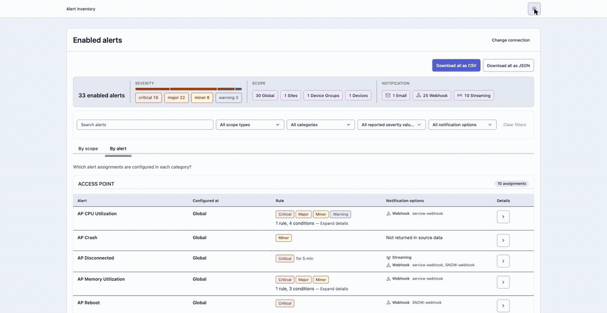
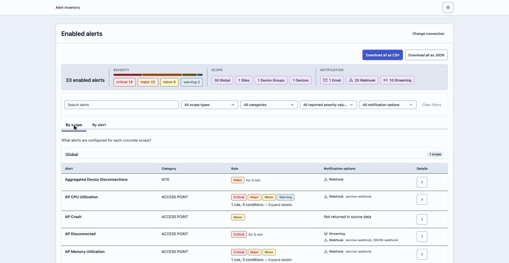
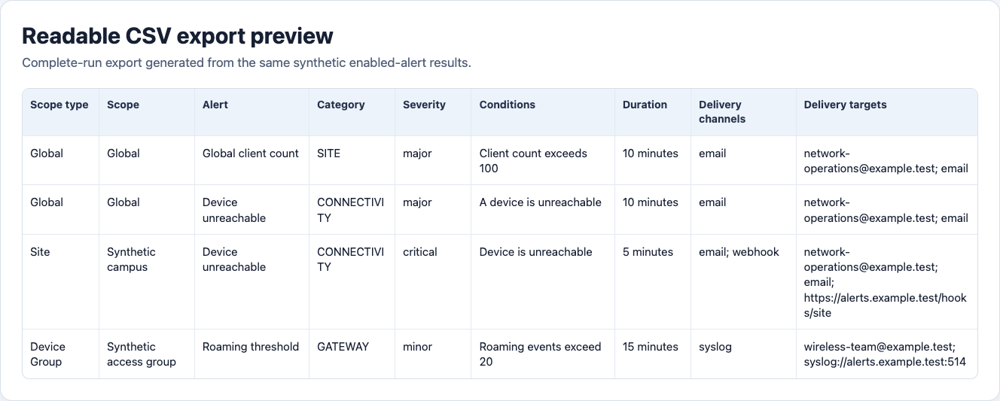

# Alert Inventory

This workflow helps users fetch the alert configurations currently enabled in Classic Central. It creates a read-only inventory of the alert assignments visible to the supplied access token, making it easier to review what is active and export the results for review, validation, or recordkeeping.

The tool fetches enabled alerts and sorts assignments by scope, severity, etc. & then download the configuration as JSON or CSV.




## Features

- **Enabled Alert Retrieval** - Fetches the alert configurations currently enabled in Classic Central and visible to the supplied access token
- **UI Review** - Lets users start an extraction, monitor retrieval progress, and review completed results in a browser
- **Scope-Aware Inventory** - Groups enabled alert assignments by scope so users can understand where each alert applies
- **JSON and CSV Exports** - Downloads the complete schema-v1 JSON inventory or a readable CSV companion from the UI
- **CLI Support** - Provides a command-line alternative that writes a timestamped schema-v1 JSON export
- **Read-Only Operation** - Does not change Central configuration or apply alert settings

Results are limited to enabled alert settings visible to the supplied token. Disabled settings are not exported.

## Prerequisites

- Python 3.10 or later
- Network access to the Classic Central API origin
- A Classic Central access token authorized to read alert settings

## Installation

1. Clone this repository and open its directory:

```sh
git clone -b v2 https://github.com/aruba/central-python-workflows.git
cd transition/alert-inventory
```

2. Create a virtual environment and install the dependencies for your platform.

### macOS and Linux

```sh
python3 -m venv .venv
source .venv/bin/activate
python3 -m pip install -r requirements.txt
```

### Windows PowerShell

```powershell
py -3 -m venv .venv
.venv\Scripts\Activate.ps1
py -3 -m pip install -r requirements.txt
```

`requirements.txt` installs pinned compatible FastAPI and Uvicorn versions.

## Configuration

### UI Credentials (Recommended)

Select a Classic Central cluster and enter its access token in the browser.

### Saved Credentials (Optional)

Select **Save token on this device** before starting an extraction to retain the token for a later UI launch. The service writes `token.json` atomically, with restricted file permissions where supported, only after access validation and a successful extraction. A later UI launch automatically starts an extraction when it finds a structurally valid saved token. If the token is invalid or expired, the file remains unchanged and the UI keeps the selected cluster while requesting a replacement token.

> [!WARNING]
> `token.json` contains an access token. It is gitignored, but keep it private: never commit, share, or paste it into an issue.

### CLI Credentials (Alternative)

The CLI reads `token.json` from the repository root. This is the same optional credential store used by the UI. Copy the example, then edit the copy:

**macOS and Linux**

```sh
cp token.json.example token.json
```

**Windows PowerShell**

```powershell
Copy-Item token.json.example token.json
```

Use this nested structure:

```json
{
  "base_url": "CENTRAL_BASE_URL",
  "token": {
    "access_token": "REPLACE_WITH_YOUR_CLASSIC_CENTRAL_ACCESS_TOKEN"
  }
}
```

`base_url` must be the HTTPS origin for the Classic Central account. Include the scheme and optional port, but no path, query, fragment, or credentials. `token.access_token` must be a non-empty string.

## Execution

### UI (Recommended)

Run the UI from the repository root:

```sh
python3 -m alert_inventory.ui
```

To choose a port:

```sh
python3 -m alert_inventory.ui --port 9000
```

Use this command on Windows PowerShell:

```powershell
py -3 -m alert_inventory.ui
```

The command prints the complete `http://127.0.0.1:PORT/` URL and opens it in the default browser. If the browser does not open, copy the printed URL into Chrome or Edge on the same computer. The UI supports current versions of Chrome and Edge on desktop. Mobile browsers are outside the supported scope. Keep the terminal open while using the application, and press `Ctrl+C` there to stop the service cleanly.

The UI shows access validation and page-level retrieved counts. A cancellation request stops before the next request or retry; an already in-flight request can continue until its timeout, and partial results are discarded. Retrying a recoverable failure reuses credentials held only in local process memory without sending the token back from the browser.

### CLI (Alternative)

Run the CLI extraction from the repository root:

```sh
python3 -m alert_inventory.cli extract
```

Use this command on Windows PowerShell:

```powershell
py -3 -m alert_inventory.cli extract
```

| Option | Description |
| --- | --- |
| `--output PATH` | Write the export to `PATH` instead of the default timestamped file. |
| `--overwrite` | Replace an existing `--output PATH` file. It cannot be used without `--output`. |

Examples:

```sh
python3 -m alert_inventory.cli extract --output customer-alerts.json
python3 -m alert_inventory.cli extract --output customer-alerts.json --overwrite
```

Use `python3 -m alert_inventory.cli --help`, `python3 -m alert_inventory.cli extract --help`, or `python3 -m alert_inventory.ui --help` for command help.

## Output

### UI Results

Completed results remain available in **Previous runs** only while the UI process is running. Select a completed run to review it again, download its complete source export with **Download all as JSON**, or download its readable companion with **Download all as CSV**. Search and filters never limit either download. Stopping the UI clears this in-memory history.

The results view groups enabled alert assignments by scope:



The CSV contains one row per alert assignment and starts with these eight columns: Scope type, Scope, Alert, Category, Severity, Conditions, Duration, and Notification options. Multiple notification options use `; `, multiple targets within one option use `, `, and absent values are blank. Downloads use UTF-8 with a BOM and CRLF line endings. The CSV is a readable flattened view; the JSON download remains the canonical schema-v1 export.



### CLI JSON Export

Without `--output`, the CLI writes a timestamped file in the current directory:

```text
classic-central-enabled-alert-configs-YYYYMMDDTHHMMSSZ.json
```

The schema-v1 JSON document contains `schema_version`, `source` (the endpoint and extraction timestamp), `counts` (reported, retrieved, enabled, and disabled), and `settings` (the enabled alert settings).

> [!WARNING]
> JSON and CSV exports can contain sensitive user configuration. Store them securely and do not share them publicly.

## Troubleshooting

| Problem | Fix |
| --- | --- |
| Invalid access (HTTP `401` or `403`) | Enter a new access token and start another extraction. |
| Rate limited (HTTP `429`) | Wait a few minutes, then retry this extraction. |
| Service unavailable (HTTP `5xx`) | Classic Central is temporarily unavailable. Retry this extraction. |
| Request rejected (another HTTP status) | Check the selected cluster and access token, then start a new extraction. |
| Network failure (no HTTP status) | Check the network connection, then retry this extraction. |
| Browser does not open | Copy the printed `http://127.0.0.1:PORT/` URL into Chrome or Edge on the same computer. |
| Local port cannot be reached | Confirm the command is still running and use the exact printed URL; the service accepts connections only. |
| UI assets are missing | Restore or download a complete, unmodified source checkout. |
| `Extraction failed.` | Confirm that `token.json` is a regular file in the repository root, contains valid JSON, and has the exact nested credential shape above. |
| Credential configuration is rejected | Confirm `base_url` is an HTTPS origin only, without a path or query, and `token.access_token` is non-empty. |
| The output file already exists | Choose another `--output` path, or add `--overwrite` with an explicit `--output` path. |
| The export is empty | Confirm that the token can view enabled notification settings; disabled settings are not exported. |

## Support

- **Automation Team**: [aruba-automation@hpe.com](mailto:aruba-automation@hpe.com)
- **Workflow Issues**: [GitHub Issues](https://github.com/aruba/central-python-workflows/issues)
- **PyCentral Library**: [PyCentral Issues](https://github.com/aruba/pycentral/issues)
