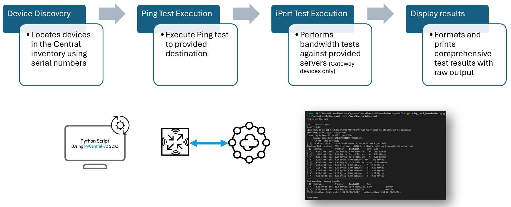

# Ping and iPerf Troubleshooting Workflow

This script automates network troubleshooting tasks using the new HPE Aruba Networking Central APIs. The workflow performs comprehensive connectivity testing by executing ping tests and iPerf bandwidth tests on gateway devices to validate network performance and connectivity.



The troubleshooting workflow performs the following operations:

1. **Device Discovery**: Locates devices in the Central inventory using serial numbers
2. **Ping Test Execution**: Runs connectivity tests to specified destinations
3. **iPerf Test Execution**: Performs bandwidth tests against designated iPerf servers (Gateway devices only)
4. **Results Processing**: Formats and displays comprehensive test results with raw output

> [!NOTE]
> The iPerf test is only supported on Gateway devices and may take upwards of 1 minute to execute completely.

## Prerequisites

This script assumes the following regarding your new Central environment:
- Gateway devices have been added to Central and are online
- Gateway devices have connectivity to the specified ping destinations and iPerf servers


## Installation

1. Clone the repository and navigate to this workflow folder
```bash
git clone -b v2 https://github.com/aruba/central-python-workflows.git
cd central-python-workflows/troubleshooting-workflow
```

2. Create and activate a virtual environment, then install dependencies
- On macOS/Linux: source venv/bin/activate
- On Windows (PowerShell): venv\Scripts\Activate.ps1

```bash
python3 -m venv env
source env/bin/activate  # On Windows use: env\Scripts\activate
pip install -r requirements.txt
```


## Configuration

### Credentials Configuration (account_credentials.yaml)

For API operations in new HPE Aruba Networking Central:

```yaml
new_central:
    cluster_name: <cluster-name>  # or base_url: <central-api-base-url>
    client_id: <new-central-client-id>
    client_secret: <new-central-client-secret>
```
**Sample Input:** See [`account_credentials.yaml`](./account_credentials.yaml) in this repository for an example credential file.


> [!TIP]
> **Where to find these:**
> - [Central API Gateway Base URLs](https://developer.arubanetworks.com/new-central/docs/getting-started-with-rest-apis#api-gateway-base-urls) 
> - [How to get API Credentials for new Central](https://developer.arubanetworks.com/new-central/docs/generating-and-managing-access-tokens) 

### Workflow Input Data

The workflow variables file defines the devices and test parameters for the troubleshooting workflow:

```yaml
devices:
  - serial: <device-serial-number>
    name: <device-friendly-name>
    ping_destination: <ip-address-or-hostname>
    iperf_server: <iperf-server-ip-address>
```

| Parameter | Type | Required | Description |
|-----------|------|----------|-------------|
| `serial` | string | Yes | The serial number of the Gateway device in Central |
| `name` | string | No | Friendly name for identification purposes (used for logging) |
| `ping_destination` | string | Yes | Target IP address or hostname for connectivity testing (e.g., 8.8.8.8) |
| `iperf_server` | string | Yes | IP address of the iPerf server for bandwidth testing |

**Example Configuration:**
```yaml
devices:
  - serial: DL0006931
    name: BO-BLR-GTW02
    ping_destination: 8.8.8.8
    iperf_server: 154.81.51.4
  - serial: DL0006932
    name: BO-BLR-GTW03
    ping_destination: 1.1.1.1
    iperf_server: 192.168.1.100
```

**Sample Input:** See `workflows_variables.yaml` in this repository for an example variables file.

## Execution

Run the script with the required arguments:

```bash
python ping_iperf_troubleshooting.py -c account_credentials.yaml -vars workflows_variables.yaml
```

### Command Line Options

| Name | Type | Description | Required |
|------|------|-------------|----------|
| `-c`, `--account_credentials` | string | Path to the account credentials YAML file | Yes |
| `-vars`, `--workflow_variables` | string | Path to the workflow variables YAML file | Yes |

### Output

The script produces detailed output for both ping and iPerf tests. Each test result includes:

1. A header identifying the device and test type
2. Raw command output with detailed connectivity or performance metrics
3. Summary statistics for quick assessment

```
Running ping test on device DL0006931 to 8.8.8.8
============================================================
PING TEST RESULTS FOR DEVICE: DL0006931
============================================================

! - Success  . - Failure  D - Duplicate Response
Press 'q' to abort.
Sending 5, 92-byte ICMP Echos to 8.8.8.8, timeout is 2 seconds:
!!!!!
Success rate is 100 percent (5/5), round-trip min/avg/max = 6.923/6.9694/7.017 ms


============================================================

Starting iperf test...
============================================================
PING TEST RESULTS FOR DEVICE: DL0006931
============================================================

Perf-test: Finished

Aug 12 11:45:27 2025
iperf 3.0.11
Linux BO-BLR-GTW02 2.6.32.11 #87317 SMP PREEMPT Wed Jul 5 17:52:04 UTC 2023 mips64 unknown
Time: Tue, 12 Aug 2025 18:45:27 GMT
Connecting to host 154.81.51.4, port 5201
      Cookie: BO-BLR-GTW02.1755024327.058856.4043f
      TCP MSS: 1368 (default)
[  6] local 10.97.55.243 port 41348 connected to 154.81.51.4 port 5201
Starting Test: protocol: TCP, 1 streams, 131072 byte blocks, omitting 0 seconds, 10 second test
[ ID] Interval           Transfer     Bandwidth       Retr  Cwnd
[  6]   0.00-1.00   sec  82.8 KBytes   678 Kbits/sec    0   28.1 KBytes
[  6]   1.00-2.00   sec  1.25 MBytes  10.5 Mbits/sec    0    458 KBytes
[  6]   2.00-3.00   sec  3.91 MBytes  32.8 Mbits/sec    1   1.28 MBytes
[  6]   3.00-4.00   sec  0.00 Bytes  0.00 bits/sec   10   4.01 KBytes
[  6]   4.00-5.00   sec  0.00 Bytes  0.00 bits/sec   29   13.4 KBytes
[  6]   5.00-6.00   sec  0.00 Bytes  0.00 bits/sec   30   6.68 KBytes
[  6]   6.00-7.00   sec  0.00 Bytes  0.00 bits/sec   42   16.0 KBytes
[  6]   7.00-8.00   sec  0.00 Bytes  0.00 bits/sec    7   5.34 KBytes
[  6]   8.00-9.00   sec  0.00 Bytes  0.00 bits/sec   28   9.35 KBytes
[  6]   9.00-10.00  sec  0.00 Bytes  0.00 bits/sec   34   12.0 KBytes
- - - - - - - - - - - - - - - - - - - - - - - - -
Test Complete. Summary Results:
[ ID] Interval           Transfer     Bandwidth       Retr
[  6]   0.00-10.00  sec  5.24 MBytes  4.39 Mbits/sec  181             sender
[  6]   0.00-10.00  sec  2.62 MBytes  2.20 Mbits/sec                  receiver
CPU Utilization: local/sender 3.8% (1.0%u/2.9%s), remote/receiver 0.0% (0.0%u/0.0%s)

iperf Done.

============================================================
```

## Troubleshooting

- **Credentials Issues**: Ensure your credentials file is valid and in the correct format with proper permissions
- **Device Not Found**: Verify the serial numbers match those in Central and the devices are online
- **Ping Failure**: Check that the ping destinations are reachable from the devices
- **iPerf Test Failure**: Confirm that the iPerf server is accessible and properly configured
- **API Errors**: This script uses a beta version of the pycentral library. If you encounter API errors, check for updated versions or please submit an issue.


## Support

- **Automation Team**: [aruba-automation@hpe.com](mailto:aruba-automation@hpe.com)
- **Workflow Issues**: [GitHub Issues](https://github.com/aruba/central-python-workflows/issues)
- **PyCentral Library**: [PyCentral Issues](https://github.com/aruba/pycentral/issues)
